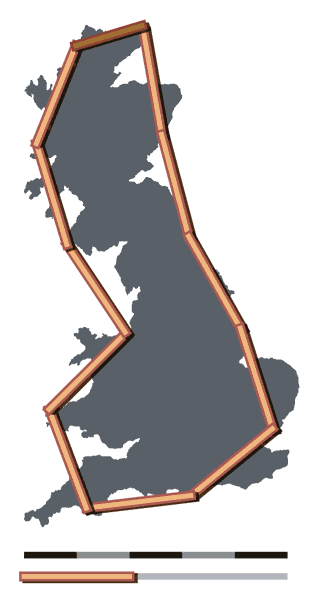
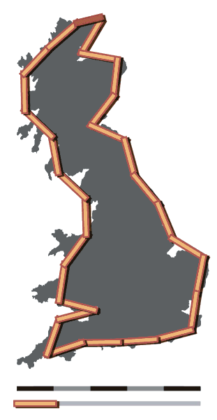
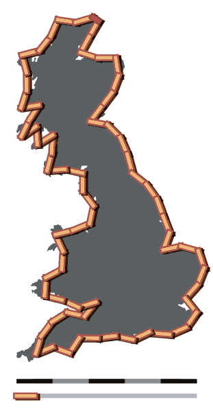
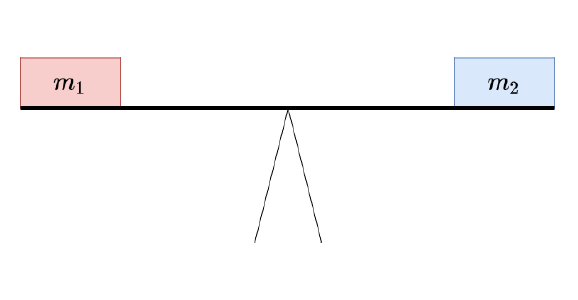
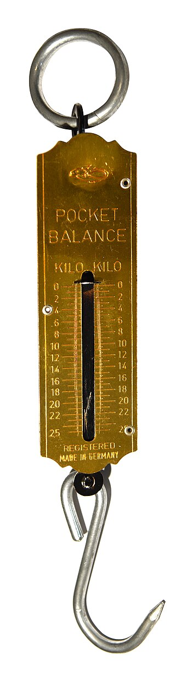
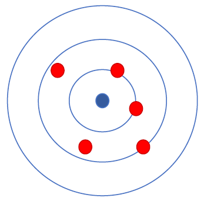

# The Principle of Measurements {#sec-introduction}

::: {.border layout="[[5, 90, 5], [1]]"}

&nbsp;

"In physics, only that which has been measured truly exists" (Merz 1968, 14).

&nbsp;

Merz, Ludwig. 1968. *Grundkurs der Messtechnik. Teil I: Das Messen elektrischer Größen.* 2nd edition. Munich; Vienna. R. Oldenbourg Verlag.

:::

In this module, the following packages are used:

``` {python}
import numpy as np
import numpy.polynomial.polynomial as poly
import pandas as pd
import matplotlib.pyplot as plt
import scipy
import glob
```

Physical quantities are determined with the help of measuring instruments. These assign a numerical value to the actual characteristic relative to a reference system.

An example: “Johanna measures 173 centimeters on the measuring board.”

  - The actual characteristic is Johanna’s height.
  - The measuring instrument is the measuring board.
  - The numerical value is 173.
  - The reference system is the metric system.

Measured values can only ever be approximations of the true value of the underlying physical quantity for various reasons. On the one hand, a person’s [height varies over the course of the day](https://www.barmer.de/presse/presseinformationen/newsletter-gesundheit-im-blick/koerpergroesse-1126334). On the other hand, the measurement result also depends on the scale used. If the measurement had been taken in the imperial system, Johanna’s height would have been determined as 68 inches, which corresponds to 172.72 centimeters.

The measurement result is therefore not an exact representation of the actual characteristic. A well-known example of the uncertainty associated with the measurement process is the coastline paradox: The result of measuring irregular coastlines becomes larger the smaller the chosen measurement segments are.

::: {.border}
:::: {#fig-coastlines layout-ncol=3}

{fig-alt="Depiction of the British coastline with measurement segments."}

{fig-alt="Depiction of the British coastline with measurement segments."}

{fig-alt="Depiction of the British coastline with measurement segments."}

Coastline paradox

::::

Britain-fractal-coastline-200km, Britain-fractal-coastline-100km, and Britain-fractal-coastline-50km by Maksim are licensed under [CC BY-SA 3.0](https://creativecommons.org/licenses/by-sa/3.0/deed.de) and available on Wikipedia ([200km](https://de.wikipedia.org/wiki/Datei:Britain-fractal-coastline-200km.png), [100km](https://de.wikipedia.org/wiki/Datei:Britain-fractal-coastline-100km.png), [50km](https://de.wikipedia.org/wiki/Datei:Britain-fractal-coastline-50km.png)). 2006

:::

&nbsp;

## Measurement

:::{#imp-Beispiel .callout-important}
## Measurement

“A measurement is the experimental process by which a specific value of a physical quantity is determined as a multiple of a unit or reference value.

The measurement first yields a measured value. However, due to external influences, this value practically never agrees exactly with the true value of the measured quantity but shows some measurement deviation. A *complete measurement result* is obtained when the measured value is supplemented with quantitative statements about the expected magnitude of the measurement deviation. In metrology, this is regarded as part of the measurement task and thus part of the measurement itself.”

*Measurement*, by various [authors](https://xtools.wmcloud.org/authorship/de.wikipedia.org/Messung), is licensed under [CC BY-SA 4.0](https://creativecommons.org/licenses/by-sa/4.0/deed.de) and available on [Wikipedia](https://de.wikipedia.org/wiki/Messung). 2025

  - An ideal measurement is a direct measurement or the desired value depends linearly on the measured value.
  - An ideal measurement is *accurate* and *precise*.

:::

### Direct and indirect measurement
In a direct measurement, the measured quantity is obtained by direct comparison with a standard or a defined reference system.

::: {.border}
:::: {#fig-direktemessung layout-ncol=2}

{height=200 fig-alt="Diagram of a beam balance"}

{height=200 fig-alt="Several folding rulers"}

Direct measurement

::::

Folding rulers by Fst76 are licensed under [CC-BY-SA 3.0](https://creativecommons.org/licenses/by-sa/3.0/) and available on [Wikimedia](https://commons.wikimedia.org/wiki/File:Gliederma%C3%9Fst%C3%A4be.jpg). 2014
:::

&nbsp;

In an indirect measurement, the measured quantity is related to another physical quantity.

::: {.border}
:::: {#fig-indirektemessung layout-ncol=2}

{height=200 fig-alt="Picture of a spring scale"}

{height=200 fig-alt="Laser distance measurement"}

Indirect measurement

::::

Spring scale by Amada44 is licensed under [CC-BY-SA-3.0 unported](https://creativecommons.org/licenses/by-sa-3.0/deed.en) and available on [Wikimedia](https://commons.wikimedia.org/wiki/File:Spring_scale_-_3241.jpg). 2016

Observe the Moon was published by NASA and is available at [nasa.gov](https://www.nasa.gov/image-article/observe-moon/). 2010

:::

&nbsp;

### Accuracy and precision

::: {#fig-genauigkeit layout-ncol=2}
{fig-alt="Stylized target with 5 shots scattered around the center."}

{fig-alt="Stylized target with 5 shots close together but away from the center."}

The accuracy of a measurement describes how close the measured values are to the real value. Accuracy can only be determined when accepted reference values exist.

The precision of a measurement describes how well the individual measured values agree with each other. The precision of a measurement is determined using the standard deviation of the sample.

Accuracy and precision
:::

## Measurement series
To reduce measurement uncertainty, a measured value can be repeatedly recorded as part of a measurement series. The best estimate of the measured quantity is given by the arithmetic mean.

The arithmetic mean of a measurement series $\bar{x}$ is the sum of all individual measured values $x_i$ divided by the number of measurements $N$.

$$
\bar{x} = \frac{1}{N} \sum_{i=1}^{N} x_i
$$

Using the arithmetic mean, we can assess the scatter of measured values and the precision of the measurement by calculating the variance and standard deviation.

::: {.panel-tabset}
## Variance

Variance is the mean of the squared deviations from the mean.

$$
\text{Var}(x_i) = \frac{1}{N} \sum_{i=1}^{N}(x_i - \bar{x})^2
$$

## Standard deviation
The square root of the variance is the standard deviation. It has the same unit as the measured values and is therefore easier to interpret. The standard deviation $s$ is calculated as:

$$
s_{N} = \sqrt{\frac{1}{N} \sum_{i=1}^{N}(x_i - \bar{x})^2}
$$

For samples, the sample variance is used. The following applies to the standard deviation of a sample:

$$
s_{N-1} = \sqrt{\frac{1}{N-1} \sum_{i=1}^{N}(x_i - \bar{x})^2}
$$

:::

Since the variance is the square of the standard deviation $s$, it is often denoted as $s^{2}$.

::: {#wrn-Grundgesamtheit .callout-warning appearance="simple"}
## Standard deviation and variance in the population

In statistics, formulas are often written with Greek letters when referring to the entire population.

The population mean is also called the expected value and is denoted by the Greek letter $\mu$ (mu). The standard deviation of the expected value is denoted by $\sigma$ (sigma).

$$
\sigma = \sqrt{\frac{1}{N} \sum_{i=1}^{N}(x_i - \mu)^2}
$$

:::

Using the standard deviation, the *standard error of the mean* can be determined. The standard error of the mean indicates how closely the arithmetic mean of the sample approximates the population mean (more on this shortly) and is also called the *sampling error*. It is calculated from the standard deviation and the square root of the sample size.

$$
\sigma_{\bar{x}} ~ = ~ \frac{s}{\sqrt{N}}
$$

Since the population standard deviation is usually unknown, the standard error of the mean is estimated using the sample standard deviation.

$$
\sigma_{\bar{x}}~ = ~ \frac{s_{n-1}}{\sqrt{N}}
$$

Sometimes, the standard error is rewritten in long form:

$$
\sigma_{\bar{x}} ~ = ~ \frac{s_{n-1}}{\sqrt{N}} ~ = ~ \sqrt{\frac{1}{N(N-1)} \sum_{i=1}^{N}(x_i - \bar{x})^2}
$$

The standard error becomes smaller (the measurement becomes more precise) the smaller the population variance and the larger the sample size.

This can be illustrated using a simulated dice experiment. For an ideal, fair die, each face appears equally often. The expected value of a six-sided die is:

$$
\frac{1}{6} \sum_{i=1}^{i=6}(x_i) ~ = ~ 3.5
$$

The standard deviation of a fair six-sided die is:

$$
\sqrt{\frac{1}{6} \sum_{i=1}^{i=6}(x_i - 3.5)^2} ~ \approx ~ 1.71 
$$

Since the population variance is known, the standard error of the mean depends only on the sample size.

### Experiment: Distribution characteristics
In a simulated experiment, 100 people each roll a die 3, 10, and 50 times and compute the mean of their rolls. Because a fair die is simulated, the standard error can be calculated using the population standard deviation.

::: {.panel-tabset}
## Results
``` {python}
#| echo: false

personen = 100
standardabweichung_grundgesamtheit = np.arange(1, 7).std(ddof = 0)
seed = 1

# 3 Würfe
würfe = 3

## Personen stehen in den Zeilen (axis = 0), Würfe in den Spalten (axis = 1)
augen3 = np.random.default_rng(seed = seed).integers(low = 1, high = 6, endpoint = True, size = (personen, würfe)) # high is exclusive if endpoint = False

## zeilenweise Mittelwert bilden mit np.array.mean(axis = 1)
print(f"Rolls per person: {würfe}\t\t\t\t",
      f"Sample size: {würfe * personen}\n",
      f"Smallest mean: {augen3.mean(axis = 1).min():.2f}\t\t",
      f"Largest mean: {augen3.mean(axis = 1).max():.2f}\n",
      f"Sample mean: {augen3.mean():.2f}\t\t",
      f"Standard error: {standardabweichung_grundgesamtheit / ( augen3.size ** (1/2) ):.2f}\n",
      sep = "")

# 10 Würfe
würfe = 10

## Personen stehen in den Zeilen (axis = 0), Würfe in den Spalten (axis = 1)
augen10 = np.random.default_rng(seed = seed).integers(low = 1, high = 6, endpoint = True, size = (personen, würfe)) # high is exclusive if endpoint = False

## zeilenweise Mittelwert bilden mit np.array.mean(axis = 1)
print(f"Rolls per person: {würfe}\t\t\t",
      f"Sample size: {würfe * personen}\n",
      f"Smallest mean: {augen10.mean(axis = 1).min():.2f}\t\t",
      f"Largest mean: {augen10.mean(axis = 1).max():.2f}\n",
      f"Sample mean: {augen10.mean():.2f}\t\t",
      f"Standard error: {standardabweichung_grundgesamtheit / ( augen10.size ** (1/2) ):.2f}\n",
      sep = "")

# 50 Würfe
würfe = 50

## Personen stehen in den Zeilen (axis = 1), Würfe in den Spalten (axis = 1)
augen50 = np.random.default_rng(seed = seed).integers(low = 1, high = 6, endpoint = True, size = (personen, würfe)) # high is exclusive if endpoint = False

## zeilenweise Mittelwert bilden mit np.array.mean(axis = 1)
print(f"Rolls per person: {würfe}\t\t\t",
      f"Sample size: {würfe * personen}\n",
      f"Smallest mean: {augen50.mean(axis = 1).min():.2f}\t\t",
      f"Largest mean: {augen50.mean(axis = 1).max():.2f}\n",
      f"Sample mean: {augen50.mean():.2f}\t\t",
      f"Standard error: {standardabweichung_grundgesamtheit / ( augen50.size ** (1/2) ):.2f}\n",
      sep = "")
```

As the number of rolls increases, the minimum and maximum of the individual average values as well as the sample mean approach the expected value.

*Note: Since the script is generated dynamically, the random numbers were created using a fixed seed value.*

## graphical representation
The frequency of the individual mean values is shown in the following histograms.

```{python}
#| echo: false
#| fig-alt: "Shown are three histograms for 3, 10, and 30 rolls per person. While 3 rolls still produce a wide range of mean values, the variation becomes increasingly narrow for 10 and 30 rolls per person."

persons = 100
population_standard_deviation = np.arange(1, 7).std(ddof = 0)
seed = 1

# 3 rolls
rolls = 3
faces3 = np.random.default_rng(seed = seed).integers(low = 1, high = 6, endpoint = True, size = (persons, rolls))  # high is exclusive if endpoint = False

# 10 rolls
rolls = 10
faces10 = np.random.default_rng(seed = seed).integers(low = 1, high = 6, endpoint = True, size = (persons, rolls))

# 50 rolls
rolls = 50
faces50 = np.random.default_rng(seed = seed).integers(low = 1, high = 6, endpoint = True, size = (persons, rolls))

# plotting
bins = 10

fig, (ax1, ax2, ax3) = plt.subplots(1, 3, sharey = True)

# 3 rolls
ax1.hist(faces3.mean(axis = 1), bins = bins, alpha = 0.6, edgecolor = 'black', range = (1, 6))
ax1.set_xlim(1, 6)
ax1.axvline(x = 3.5, ymin = 0, ymax = 1, color = 'black', label = 'Expected value')
ax1.set_ylabel('Frequency of mean value')
ax1.set_title("3 rolls per person")
ax1.legend(loc = 'lower left', bbox_to_anchor = (0, -0.2))

# 10 rolls
ax2.hist(faces10.mean(axis = 1), bins = bins, alpha = 0.6, edgecolor = 'black', range = (1, 6))
ax2.set_xlim(1, 6)
ax2.axvline(x = 3.5, ymin = 0, ymax = 1, color = 'black')
ax2.set_title("10 rolls per person")

# 30 rolls (data: 50 rolls)
ax3.hist(faces50.mean(axis = 1), bins = bins, alpha = 0.6, edgecolor = 'black', range = (1, 6))
ax3.set_xlim(1, 6)
ax3.axvline(x = 3.5, ymin = 0, ymax = 1, color = 'black')
ax3.set_title("30 rolls per person")

plt.tight_layout()
plt.show()
```

## Code

Calculation

```{python}
#| output: false

people = 100
population_std_dev = np.arange(1, 7).std(ddof = 0)
seed = 1

# 3 rolls
rolls = 3

## People are in rows (axis = 0), rolls in columns (axis = 1)
dice3 = np.random.default_rng(seed = seed).integers(low = 1, high = 6, endpoint = True, size = (people, rolls)) # high is exclusive if endpoint = False

## Compute row-wise mean with np.array.mean(axis = 1)
print(f"Rolls per person: {rolls}\t\t\t\t",
      f"Sample size: {rolls * people}\n",
      f"Smallest mean: {dice3.mean(axis = 1).min():.2f}\t\t",
      f"Largest mean: {dice3.mean(axis = 1).max():.2f}\n",
      f"Sample mean: {dice3.mean():.2f}\t\t",
      f"Standard error: {population_std_dev / ( dice3.size ** (1/2) ):.2f}\n",
      sep = "")

# 10 rolls
rolls = 10

## People are in rows (axis = 0), rolls in columns (axis = 1)
dice10 = np.random.default_rng(seed = seed).integers(low = 1, high = 6, endpoint = True, size = (people, rolls)) # high is exclusive if endpoint = False

## Compute row-wise mean with np.array.mean(axis = 1)
print(f"Rolls per person: {rolls}\t\t\t",
      f"Sample size: {rolls * people}\n",
      f"Smallest mean: {dice10.mean(axis = 1).min():.2f}\t\t",
      f"Largest mean: {dice10.mean(axis = 1).max():.2f}\n",
      f"Sample mean: {dice10.mean():.2f}\t\t",
      f"Standard error: {population_std_dev / ( dice10.size ** (1/2) ):.2f}\n",
      sep = "")

# 50 rolls
rolls = 50

## People are in rows (axis = 0), rolls in columns (axis = 1)
dice50 = np.random.default_rng(seed = seed).integers(low = 1, high = 6, endpoint = True, size = (people, rolls)) # high is exclusive if endpoint = False

## Compute row-wise mean with np.array.mean(axis = 1)
print(f"Rolls per person: {rolls}\t\t\t",
      f"Sample size: {rolls * people}\n",
      f"Smallest mean: {dice50.mean(axis = 1).min():.2f}\t\t",
      f"Largest mean: {dice50.mean(axis = 1).max():.2f}\n",
      f"Sample mean: {dice50.mean():.2f}\t\t",
      f"Standard error: {population_std_dev / ( dice50.size ** (1/2) ):.2f}\n",
      sep = "")
```

```{python}
#| output: false

people = 100
population_std_dev = np.arange(1, 7).std(ddof = 0)
seed = 1

# 3 rolls
rolls = 3
dice3 = np.random.default_rng(seed = seed).integers(low = 1, high = 6, endpoint = True, size = (people, rolls)) # high is exclusive if endpoint = False

# 10 rolls
rolls = 10
dice10 = np.random.default_rng(seed = seed).integers(low = 1, high = 6, endpoint = True, size = (people, rolls)) # high is exclusive if endpoint = False

# 50 rolls
rolls = 50
dice50 = np.random.default_rng(seed = seed).integers(low = 1, high = 6, endpoint = True, size = (people, rolls)) # high is exclusive if endpoint = False

# plotting
bins = 10

# 3 rolls
fig, (ax1, ax2, ax3) = plt.subplots(1, 3, sharey = True)

ax1.hist(dice3.mean(axis = 1), bins = bins, alpha = 0.6, edgecolor = 'black', range = (1, 6))
ax1.set_xlim(1, 6)
ax1.axvline(x = 3.5, ymin = 0, ymax = 1, color = 'black', label = 'Expected value')
ax1.set_ylabel('Mean dice result')
ax1.set_ylabel('Frequency of mean')
ax1.set_title("3 rolls per person")
ax1.legend(loc = 'lower left', bbox_to_anchor = (0, -0.2))

# 10 rolls
ax2.hist(dice10.mean(axis = 1), bins = bins, alpha = 0.6, edgecolor = 'black', range = (1, 6))
ax2.set_xlim(1, 6)
ax2.axvline(x = 3.5, ymin = 0, ymax = 1, color = 'black')
ax2.set_ylabel('Mean dice result')
ax2.set_title("10 rolls per person")

# 50 rolls
ax3.hist(dice50.mean(axis = 1), bins = bins, alpha = 0.6, edgecolor = 'black', range = (1, 6))
ax3.set_xlim(1, 6)
ax3.axvline(x = 3.5, ymin = 0, ymax = 1, color = 'black')
ax3.set_ylabel('Mean dice result')
ax3.set_title("50 rolls per person")

plt.tight_layout()
plt.show()
```

:::

### Exercise Distribution Statistics

The dataset ToothGrowth.csv contains a series of measurements for the length of tooth-forming cells in guinea pigs. The animals received Vitamin C either directly (VC) or in the form of orange juice (OJ) at different doses.

::: {.border}

:::: {#lst-readfile}

```{python}
file_path = "01-daten/ToothGrowth.csv"
guinea_pigs = pd.read_csv(filepath_or_buffer = file_path, sep = ',', header = 0, \
  names = ['ID', 'len', 'supp', 'dose'], dtype = {'ID': 'int', 'len': 'float', 'dose': 'float', 'supp': 'category'})
```

::::

Crampton, E. W. 1947. “THE GROWTH OF THE ODONTOBLASTS OF THE INCISOR TOOTH AS A CRITERION OF THE VITAMIN C INTAKE OF THE GUINEA PIG.” The Journal of Nutrition 33 (5): 491–504. [https://doi.org/10.1093/jn/33.5.491](https://doi.org/10.1093/jn/33.5.491)

The dataset can be accessed in R using the command `ToothGrowth`.

```{python}
#| echo: false 
#| fig-alt: Illustrative representation of tooth length in the 'len' column

guinea_pigs['len'].plot(x = 'ID', y = 'len', title = 'Length of Odontoblasts in Guinea Pigs', xlabel = 'Number', ylabel = 'Length in Microns')
```

:::

 

**Calculate the arithmetic mean, variance, standard deviation, and sampling error of the measurement series for tooth length (`len`). Use the formulas provided.**

The result could look like this:

```{python}
#| echo: false

def distribution_statistics(x, output = True):

  # Determine the number of measurements
  N = len(x)

  # Calculate the arithmetic mean
  sample_mean = sum(x) / N

  # Calculate the sample variance
  sample_variance = sum((x - sample_mean) ** 2) / (N - 1)

  # Calculate the sample standard deviation
  sample_std_dev = sample_variance ** (1/2)

  # Calculate the sampling error
  sampling_error = sample_std_dev / (N ** (1/2))

  # Output
  if output: # output = True
    print(f"N: {N}\n",
          f"Arithmetic mean: {sample_mean:.2f}\n",
          f"Sampling error: {sampling_error:.2f}\n",
          f"Sample variance: {sample_variance:.2f}\n",
          f"Sample standard deviation: {sample_std_dev:.2f}",
          sep = '')

  else: # output = False
    return N, sample_mean, sampling_error, sample_variance, sample_std_dev

distribution_statistics(guinea_pigs['len'])
```

::: {#tip-distributionstats .callout-tip collapse="true"}

## Sample Solution: Distribution Statistics

```{python}
#| output: false

def distribution_statistics(x, output = True):

  # Determine the number of measurements
  N = len(x)

  # Calculate the arithmetic mean
  sample_mean = sum(x) / N

  # Calculate the sample variance
  sample_variance = sum((x - sample_mean) ** 2) / (N - 1)

  # Calculate the sample standard deviation
  sample_std_dev = sample_variance ** (1/2)

  # Calculate the sampling error
  sampling_error = sample_std_dev / (N ** (1/2))

  # Output
  if output: # output = True
    print(f"N: {N}\n",
          f"Arithmetic mean: {sample_mean:.2f}\n",
          f"Sampling error: {sampling_error:.2f}\n",
          f"Sample variance: {sample_variance:.2f}\n",
          f"Sample standard deviation: {sample_std_dev:.2f}",
          sep = '')

  else: # output = False
    return N, sample_mean, sampling_error, sample_variance, sample_std_dev

distribution_statistics(guinea_pigs['len'])
```

:::

### Variance and Standard Deviation with NumPy and Pandas

The NumPy and Pandas modules have built-in functions for calculating variance and standard deviation. Variance and standard deviation are calculated using the functions `np.var()` and `np.std()`, or the methods `pd.var()` and `pd.std()`. The parameter `ddof` (delta degrees of freedom) controls which denominator is used for calculating variance in the form N - ddof. While NumPy's default is `ddof=0`, Pandas calculates the sample variance with the default value `ddof=1`.

```{python}

print("Variance:")
print(f"NumPy:\t{np.var(guinea_pigs['len']):.2f}")
print(f"Pandas:\t{guinea_pigs['len'].var():.2f}")

print("\nStandard Deviation:")
print(f"NumPy:\t{np.std(guinea_pigs['len']):.2f}")
print(f"Pandas:\t{guinea_pigs['len'].std():.2f}")
```
