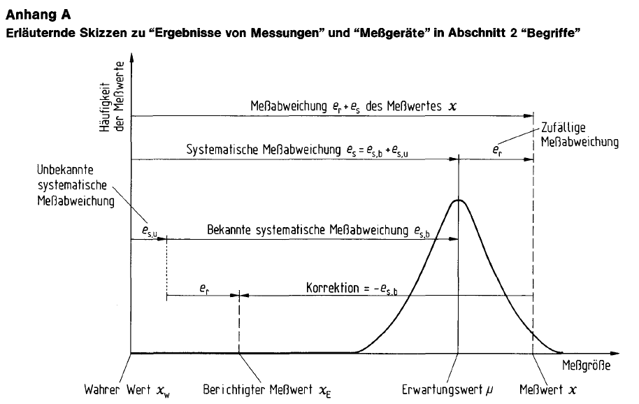
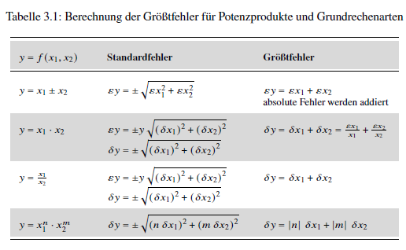

# Error Calculation

```{python}
#| echo: false

# Load modules
import numpy as np
import numpy.polynomial.polynomial as poly
import pandas as pd
import matplotlib.pyplot as plt
import scipy
import glob
```

::: {.border layout="[[5, 90, 5], [1]]"}

 

"Experimentation is a thorny path, and one is never completely certain."

 

Wagner, Paul. 2015. "Introduction to Physics I. PH I - 04 - Measurement Accuracy / Error Calculation Part 1." University of Vienna Physics, [YouTube](https://youtu.be/sF2_1YNiWXI?feature=shared&t=245), timestamp 04:05
:::

 

No measuring instrument is exact, and not all environmental influences can be controlled. The goal of error calculation is to quantify the resulting deviation of the measured values from the true value of a quantity.

## Before we begin

However, the topic comes with some challenges that make initial engagement and independent study difficult.

### The Concept of Error

Although the word "error" appears in the title of this chapter, it has not been a standardized term since 1995. DIN 1319 standardizes fundamental concepts and procedures in metrology. The standard replaces the term "error" with **measurement deviation** and **measurement uncertainty**, while also encompassing a variety of related definitions, notes, and remarks.

This chapter uses the terms commonly employed in error analysis to connect them to the standardized terminology. Generally, the standardized terms are used. To simplify the topic, this chapter is limited to measurements with:

* uncorrelated input quantities and
* negligible uncertainty in the systematic measurement deviation.

### Confidence Level

Repeated measurements contain a random component of statistical uncertainty. Statistical uncertainty can only be expressed with a probability of confidence. The calculation of confidence intervals was covered in @sec-normal-distribution and @sec-hooke.

The first step in statistical analysis is to define the confidence level. From this, the multiples of the standard deviation $s$ or the correction factor $t$ to be used are derived. Different disciplines follow different conventions.

:::{layout="[5, 90, 5]"}

 

"In physics and surveying, a statistical confidence of 68.3% is sufficient, hence t = 1 [...] (In industry t = 2, in biology t = 3 is preferred.)" [@HS-Aalen-2016 p. 4]

 
:::

In engineering literature, this step is not always explicitly stated (since $1 s$ or $1 t$ is commonly used). DIN 1319 states: "It is customary to specify the confidence level ($1 - \alpha$) as a percentage, usually $\alpha = 0.05$ (confidence level: 95%)." [@DIN1319-1, p. 17]

### Notation

The notation is complex: alongside the Latin and Greek alphabets, the Cyrillic alphabet is also used. Nevertheless, symbol duplication for formula symbols and units cannot always be avoided (the spring constant is particularly unfortunate in this respect).

Notation is also inconsistently applied. While DIN 1319 uses $e$ for measurement deviations, literature often uses $\epsilon$ (epsilon) and $\Delta$ (Delta), with the latter also used for maximum error.

By the way: the $e$ in DIN stands for "error" ( ¯\\\_(ツ)\_/¯ ).

## Types of Errors

Measurements can exhibit different types of deviations from the true value of the quantity. The most common classification is into gross, systematic, and random *errors*. According to DIN 1319, it is better to speak of systematic and random measurement deviations. Gross errors are not covered by the standard, and the term "error" is appropriate here.

* Systematic measurement deviations: constant deviations under identical conditions, i.e., with the same magnitude and sign, caused by instrument inaccuracies, for example:

  * dependent on temperature
  * faulty calibration
  * aging of components
  * type of measurement, e.g., reading and scale errors, measurement interval in digital instruments ([quantization error](https://en.wikipedia.org/wiki/Quantization_error))

* Random measurement deviations: statistical spread of values around the expectation, for example:

  * sampling error
  * reading errors

* Gross errors: distort the measurement result, for example due to:

  * incorrect experimental setup
  * unsuitable instruments
  * incorrect reading, e.g., ignoring the [settling time](https://en.wikipedia.org/wiki/Settling_time) or inattentiveness, such as weighing the container

[@Hempel-2016, p. 1-2; @EdenGebhard-2024, p. 17-18]

Some actions, like reading a value, can be associated with multiple error types:

* Inattentive reading and careless mistakes are gross errors,
* angle- and position-dependent errors like [parallax error](https://en.wikipedia.org/wiki/Parallax_error) are systematic deviations,
* errors due to limited visual resolution lead to random deviations.

::: {#tip-handlingerrors .callout-tip}

## Handling Different Types of Measurement Deviations

1. Gross errors: discard affected values and repeat the measurement.

2. Systematic deviations: corrected if known.

3. Random deviations: quantify the statistical spread around the expectation.

Some systematic and random deviations can only be reduced with significant effort (more precise instruments, larger number of measurements). The effort must be weighed against the gain in accuracy: Is the measurement result acceptable with the stated uncertainty?

(@Hempel-2016, p. 2)

:::

## Fundamental Concepts According to DIN 1319

DIN 1319 standardizes fundamental concepts and procedures in metrology.

* Part 1 DIN 1319-1 and Part 2 DIN 1319-2 define basic metrology terms and measurement instruments.
* Part 3 DIN 1319-3 deals with evaluating measurements of a *single* quantity and its measurement uncertainty. It also applies when the quantity is calculated from other quantities via a given function (e.g., velocity $v$ as distance $s$ divided by time $t$).
* Part 4 DIN 1319-4 addresses reporting measurement results and their uncertainties when quantities are calculated from other quantities, e.g., via a least squares fit.

DIN 1319-4 deals with calculating a result $Y$ through a function, e.g., a linear regression. The case in the previous chapter, determining the spring constant via regression coefficient $\beta_1$, is not addressed in the standard and thus not presented here.

The learning goal of this chapter is to explain the following figure from DIN 1319.

::: {.border}


[@DIN1319-1, p. 30]
:::

 

The three most important fundamental concepts are:

1. Measurement deviation,
2. Measurement uncertainty, and
3. Complete measurement result.

### Measurement Deviation

In error analysis, the term "error" generally refers to measurement deviation per DIN 1319, i.e., the *actual deviation* of a single measurement or the mean of a series of measurements (uncorrected measurement result) from the true value.

::: {#imp-measurementdeviation .callout-important}

## Measurement Deviation According to DIN 1319

Measurement deviation is: "the deviation of a value obtained from measurements and assigned to a quantity [...] from the true value [...]. If $m$ is the value assigned to the quantity and $x_w$ the true value, then the measurement deviation of the assigned value is $m - x_w$ [...]." [@DIN1319-1, p. 12]
:::

The deviation of the **uncorrected measurement result** consists additively of the random deviation $e_r$ and systematic deviation $e_s$.

* Systematic deviation is the difference between the expected value $\mu$ and the true value $x_w$: $e_s = \mu - x_w$
* The systematic deviation $e_s$ consists of a known part $e_{s,b}$ and an unknown part $e_{s,u}$.
* The known systematic deviation $e_{s,b}$, when applied with opposite sign $- e_{s,b}$, is called a *correction*.

The **(corrected) measurement result** $\bar{x}_E$ is the arithmetic mean of a series of measurements $\bar{x}$ corrected for the known systematic measurement deviation $e_{s,b}$, and it is used as an estimator of the true value $x_w$.
$\bar{x}_E = \bar{x} - e_{s,b}$

[@DIN1319-1, p. 11-13]

### Measurement Uncertainty

The true value is generally unknown, so the actual deviation is also unknown. Only an *estimate from the measurements*, the measurement uncertainty, can be stated. In a broader sense, "error" refers to measurement uncertainty per DIN 1319.

::: {#imp-measurementuncertainty .callout-important}

## Measurement Uncertainty According to DIN 1319

"A quantity obtained from measurements [...] used together with the measurement result [...] to characterize a **range of values** for the true value of the quantity [...]" [@DIN1319-1, p. 14, emphasis added]

While measurement deviation is a single value, uncertainty specifies a range: "Measurement uncertainty must be distinguished from measurement deviation. The latter is only the difference between a value assigned to the quantity [...] and the true value. Measurement deviation can be zero without being known. This ignorance is expressed in a measurement uncertainty greater than zero." [@DIN1319-3, p. 3]
:::

Measurement uncertainty of a quantity $Y$ consists of the random deviation $e_r$ and the uncertainty of the systematic deviation $u(e_s)$.

**Random Deviation**

If a measured quantity $Y = y(x)$ is determined through multiple direct measurements, the measured values $x_i$ randomly scatter around their expected value $\mu$ with a standard deviation $\sigma$. The expected value $\mu$ and the standard deviation $\sigma$ are usually unknown and are estimated from the measured values using the arithmetic mean $\bar x$ and the empirical standard deviation $s_{n-1}$. (see @sec-introduction)

The uncertainty of the random scatter is represented by the empirical standard deviation of the mean:

$$
u(\bar x) = \frac{s_{n-1}}{\sqrt{N}} ~ = ~ \sqrt{\frac{1}{N(N-1)} \sum_{i=1}^{N}(x_i - \bar{x})^2}
$$

[@DIN1319-3, Equation (4), p. 5, notation adjusted]

**systematic measurement error**

The systematic measurement error $e_s$ consists of a known component $e_{s,b}$ and an unknown component $e_{s,u}$. Since the unknown component cannot be determined, the total systematic measurement error is estimated using the known systematic error $e_{s,b}$. This leads to an uncertainty about the actual total systematic measurement error $u(e_s)$. This uncertainty exists even if the known systematic measurement error $e_{s,b}$ is zero, because the unknown component $e_{s,u}$ may be non-zero.

DIN 1319 distinguishes two cases, depending on whether the uncertainty $u(e_s)$ is considered negligible or not. In this chapter, we assume the uncertainty $u(e_s)$ is negligible (for the second case, see the example).

::: {#nte-uncertaintynotnegligible .callout-note collapse="true"}

## $u(e_s)$ Not Negligible

If the systematic deviation uncertainty is non-negligible, DIN 1319-3 refers to calculation rules in section 6.2.5, not discussed here. (@DIN1319-3, p. 5-6)

The uncertainty of the corrected result is the quadratic combination of random and systematic uncertainties:

$$
u(y) = \sqrt{u^2(\bar x) + u^2(e_s)}
$$

[@DIN1319-3, Eq. (8), p. 6, notation adapted]

::::{#wrn-notation2 .callout-warning appearance="simple"}

## Notation in DIN 1319

Random deviation is denoted as $u^2(x_1)$ instead of $u^2(\bar x)$, and systematic uncertainty as $u^2(x_2)$ instead of $u^2(e_s)$.
::::
:::

### Complete Measurement Result

The **corrected measurement result** $\bar{x}_E = y$ (in DIN 1319, the notation changes from $\bar{x}_E$ to $y$) is calculated by correcting the known systematic measurement deviation:

$$
y = \bar x - e_{s,b}
$$

[@DIN1319-3, Equation (7), p. 6, notation adjusted]

The **complete measurement result** $Y$ consists of the corrected measurement result and an indication of the measurement uncertainty, e.g., in the form:

$$
Y = y \pm u(y)
$$

[@DIN1319-3, Equation (9), p. 6]

*Additionally*, a confidence interval (also called confidence range or confidence level) can be specified along with the complete measurement result. We have already introduced the calculation of confidence intervals in Chapter @sec-normal-distribution.

$$
y - t \cdot u(y) \le Y \le y + t \cdot u(y)
$$

[@DIN1319-3, Equation (14), p. 7]

The choice of a confidence interval is discretionary. DIN 1319 states: "It is customary to specify the confidence level ($1 - \alpha$) as a percentage, with $\alpha = 0.05$ (confidence level: 95 %) most commonly used." [@DIN1319-1, p. 17] "This 95 % confidence level should be used, but not a higher one." [@DIN1319-3, p. 7] 

For example, this yields:

$$
y - t_{\alpha / 2} \cdot \frac{s_{n-1}}{\sqrt{n}} \le Y \le y + t_{\alpha / 2} \cdot \frac{s_{n-1}}{\sqrt{n}}
$$

:::{#wrn-notation1 .callout-warning appearance="simple"}

## Notation in DIN 1319

The arithmetic mean of a series is denoted $\bar{v}$ instead of $\bar{x}$.
:::

### Overview
DIN 1319 defines a number of additional terms, which are compiled in the following box together with the most important basic terms.

::: {#imp-DIN1319 .callout-important}
## Basic Terms According to DIN 1319

**Measurement Deviation**: "Deviation of a value obtained from measurements and assigned to the measurand [...] from the true value [...]. If $m$ is the value assigned to the measurand and $x_w$ is the true value, then the measurement deviation of the assigned value is $m - x_w$ [...]." [@DIN1319-1, p. 12]

  - The measurement deviation of the **uncorrected measurement result** consists additively of the random measurement deviation $e_r$ and the systematic measurement deviation $e_s$.
  - The systematic measurement deviation $e_s$ consists of a known part $e_{s,b}$ and an unknown part $e_{s,u}$.
  - The systematic measurement deviation is the difference between the expected value $\mu$ and the true value $x_w$. $e_s = \mu - x_w$
  - The known systematic measurement deviation $e_{s,b}$, when applied with the opposite sign $- e_{s,b}$, is called a *correction*.

The **measurement result** $\bar{x}_E$ is the arithmetic mean of a series of measurements $\bar{x}$ corrected for the known systematic measurement deviation $e_{s,b}$, used as an estimator for the expected value $\mu$.  
$\bar{x}_E = \bar{x} - e_{s,b}$

[@DIN1319-1, pp. 11-13]

**Measurement Uncertainty** $u$ or $u(y)$: "Quantity derived from measurements [...] and used together with the measurement result [...] to characterize a range of values for the true value of the measurand [...]" [@DIN1319-1, p. 14]  

  - **Standard measurement uncertainty**, or simply standard uncertainty, is used when the measurement uncertainty is expressed by a standard deviation. [@DIN1319-3, p. 3]

  - **Expanded measurement uncertainty** $U(y) = k \cdot u(y)$: Range that likely contains the true value of the measurand. The expansion factor $k$ should be set between 2 and 3, with $k = 2$ preferred. The expansion factor $k$ should be reported so that the standard measurement uncertainty $u(y) = U(y) / k$ can be determined. [@DIN1319-3, p. 7]  
  *Note: The expanded measurement uncertainty differs from a confidence interval in that no normal distribution is assumed – it is simply a factor 'to be on the safe side' that the true value is within the given range.*

The **complete measurement result** is the measurement result with quantitative information about the measurement uncertainty $u$. $x = \bar{x}_E \pm u$. [@DIN1319-1, p. 16]

  - The **confidence range** $\bar x - t \cdot u(y) \le Y \le \bar x + t \cdot u(y)$ can additionally be provided along with the complete measurement result. 
  
    - If the systematic measurement deviation is known and has been corrected, the true value of the measurand $Y$ lies within the confidence range.
    - If the systematic measurement deviation is unknown, the expected value $\mu$ of the distribution lies within the confidence range. [@DIN1319-3, p. 7]  

    *Note: In the DIN standard, the arithmetic mean of a measurement series is written as $\bar{v}$ instead of $\bar{x}$.*
:::

## Absolute and Relative Errors
In error analysis, a distinction is made between absolute and relative *errors*. It is more precise to speak of absolute and relative measurement uncertainties.

  - The **absolute measurement uncertainty** $u$ is given in the unit of the measured quantity: $u(m) = 0.2~kg$. The complete measurement result is written as: $m = 5.0 \pm 0.2~kg$ or $m = 5.0~kg \pm 0.2~kg$.
  
  - The **relative measurement uncertainty** $u_{rel}(m) = \frac{u(m)}{| m |}$ is either given in the product form as $m \cdot (1 \pm \frac{u(m)}{| m |})$, for example:

      $m = 5.0~kg \cdot \left(1 \pm \frac{0.2~kg}{5.0~kg}\right) = 5.0~kg \cdot (1 \pm 0.04)$
  
    Alternatively, the relative measurement uncertainty can be expressed as a percentage: $u_{rel}(m) = \frac{u(m)}{| m |} \cdot 100~\%$, for example:
    
      $m = 5.0~kg \pm 4~\%$.

[@DIN1319-1, pp. 9-10, 16; @DIN1319-3, p. 10]

::: {#wrn-notation .callout-warning}
## (Alternative) Notations

In DIN 1319, measurement deviations are denoted by $e$, while measurement uncertainty is denoted by $u$. In error analysis literature, the term (measurement) *error* is more commonly used. The notation, however, is not consistent.

  - The absolute error is often denoted by $\epsilon x$ (epsilon x). Another common notation is $\Delta x$ (Delta), for example [@HS-Aalen-2016; @Dinter-2011; @SchrüferEtAl2022]. $\Delta$ is also used to denote the maximum error. 

  - The relative error is also denoted by $\delta x$ (delta x), for example: $\delta x = 4~\%$.

:::

## Maximum Error
Systematic measurement deviations $e(x)_{s}$ cause a one-sided bias in the measurement result, so that the measured value is always either too high or too low. Random measurement deviations $e(x)_{r}$ lead uncontrolledly to either overestimation or underestimation of the measured value.

In general, the different measurement deviations partially cancel each other out. The **maximum error** refers to the worst-case scenario, where all measurement deviations reinforce each other at their respective maximum (or minimum) values, so that the measured value shows the largest possible deviation from the (unknown) true value. The **maximum error** is denoted as $\Delta x$ (Delta x).

The maximum error of a series of measurements for a quantity is determined by summing the absolute values of the individual measurement deviations.

$$
\Delta x = | e(x)_{s} | + | e(x)_{r} |
$$

Since measurements with gross errors are considered invalid, the contribution of gross errors $| e(x)_{gross} |$ is omitted.

(@EdenGebhard-2024, pp. 35-36)

When multiple quantities are considered, the maximum errors of the involved quantities add up to the maximum error of the resulting quantity. For a quantity $Y = f(x_1, x_2)$:
$$
\Delta y = \Delta x_1 + \Delta x_2
$$

::: {#tip-whicherror .callout-tip}
## Maximum Error

The maximum error is not a standardized specification according to DIN 1319, but a simplified form of error estimation and overestimates the likely measurement uncertainty.

"For many considerations, especially in introductory laboratory courses of the first semesters in technical, scientific, and engineering programs, it is sufficient to determine the maximum error (*absolute maximum error*)." (@EdenGebhard-2024, p. 35)
:::


## Significant Figures
When reporting a complete measurement result, the number of significant or reliably known digits must be taken into account.

::: {#imp-signif .callout-important}
## Significant Figures

"Every reliably known digit, except for zeros that indicate the position of the decimal point, is called a significant figure." [@EdenGebhard-2024, p. 24]

"Rounded numerical uncertainty values should be given **with two (or if necessary three) significant digits**. **They must be rounded up.** The measurement result should be rounded to the same place as the associated uncertainty, e.g., $y = 245.5716 \text{ mm}$ is rounded to $y = 245.57 \text{ mm}$ if $u(y) = 0.4528 \text{ mm}$ is rounded up to $u(y) = 0.46 \text{ mm}$." [@DIN1319-3, p. 6, emphasis added]
:::

For example, the distance measurements used in the previous chapter are given in the format $153.29$, which means the measurements have 5 significant figures. Therefore, the arithmetic mean of a series of measurements, $153.008889$, should also be reported with 5 significant figures. It is rounded at the first non-significant digit, so the arithmetic mean is reported as $153.01$.

However, the number of significant figures is not always straightforward to determine. The rules are:

1. All non-zero digits are always significant.
2. Leading zeros are never significant. For example, 0012 km has 2 significant figures. 0.001 mm has 1 significant figure.
3. Zeros at the end of a number are significant if they are to the right of the decimal point, e.g., 12.100 km has 5 significant figures.
4. Zeros at the end of a number without a decimal point may or may not be significant. 1200 m can have two or four significant figures.

::: {.callout-tip}
## Significant Figures and Scientific Rounding

Although uncertainty values are rounded up, it is useful to know: do you know the difference between commercial rounding and scientific rounding?



"Rounding and Significant Figures (Mathematics Prep Course)" by Edmund Weitz is available on [YouTube](https://www.youtube.com/watch?v=q2iZDtotiM0), 2019.

Python rounds scientifically:

``` {python}
print(round(2.5), round(3.5))
```

:::

## Methods of Error Analysis

The goal of error analysis is to determine uncertainty intervals for a measured quantity. Several methods are available:

1. Error estimation,
2. Statistical error analysis, and
3. Error propagation.

There is some discretion in choosing the method. (@Hempel-2016, p. 2) For routine measurements, it is sufficient to report uncertainty in percentage terms. In calibration or when comparing with a [standard](https://en.wikipedia.org/wiki/Standard), more precise information is required. [@SchrüferEtAl2022, p. 33]

The choice of the appropriate method also depends on the available information. For example, the spring constant determined in the previous chapter depends on three quantities:

1. the mass $m$, measured with a kitchen scale, whose reading accuracy is estimated as $e_r(m) = 0.5 g = 0.0005 kg$.

2. the distance to the weight, or after data processing, the spring extension $\Delta x$, measured with an electronic distance sensor and an Arduino (Ultrasonic Ranging Module HC - SR04).

   * The reading accuracy of the measurement system is one unit of the measurement resolution, i.e., $e_r = 0.01 cm = 0.0001 m$.
   * The measurement deviation of the system is up to 3 mm according to the datasheet, symmetrically, i.e., $e_r = 3 mm = 0.003 m$.
   * The random component of the measurement deviation is therefore $e_r(x) = 0.0001 m + 0.003 m = 0.0031 m$.

3. the statistical estimate of the spring constant $k = \frac{m \cdot g}{\Delta x} = 33.019 \pm 0.378$, or within the specified confidence interval $k_{95\%} = 32.269 ≤ 33.019 ≤ 33.769$.

::: {#wrn-formelzeichen .callout-warning appearance="simple"}

## Symbols and Units

The same symbols are used for second and displacement $s$, mass and meter $m$, gram, the constant $g$, and $\Delta$ for the change of a quantity and for the maximum error. Therefore, the formulas should be read carefully.
:::

### 1. Error Estimation

Error estimation is used when

* **one quantity**
* **is measured only once**.

Since the true value of a measured quantity is unknown, error estimation aims to determine the maximum possible deviation of the measured value from the true value, i.e., the **maximum error**. For a single measurement, there is no statistical component. Therefore, the error estimation for a single measurement includes:

* the guaranteed error limit of the instrument, provided by the manufacturer on the device or in the manual (see example), i.e., the known systematic measurement deviation $e_{s,b}$, and
* an estimated component depending on the specific experimental conditions, e.g., the scale division or reading conditions. This component can consist of a systematic part (e.g., an analog scale read from an angle) and a random part (e.g., reading accuracy of the instrument).

The maximum error $\Delta x$ is obtained by adding the absolute values of the known systematic deviation and the estimated random deviation: $\Delta x = |e(x)_{s,b}| + |e(x)_{r}|$.

(@Hempel-2016, p. 3)

#### Exercise: Temperature Measurement

A temperature $T = 112.1 ~ °C$ was measured using a digital thermometer with a K-type thermocouple. Which systematic and random measurement deviations are known and can be reported (see example)?

::: {#nte-thermometer .callout-note collapse="true" layout-ncol=2}

## Thermometer Guaranteed Error Limit


:::

::: {#tip-skalengenauigkeit .callout-tip}

## Half or Full Scale Division?

:::: {.border}
Digital instruments make this easy: the reading accuracy is one scale unit. For analog instruments, it is up to your judgment which measurement accuracy to report.

If you are certain you can distinguish "exactly on the line" vs. "between two lines," the reading error is half a scale division. If unsure, the reading error is one full scale division.

([Error Analysis Made Easy, FSU Jena](https://www.physik.uni-jena.de/pafmedia/9072/fehlerrechnungleichtgemachtpdf.pdf))
::::
:::

::: {#tip-thermometer .callout-tip collapse="true"}

## Sample Solution: Temperature Measurement

**Systematic measurement deviation**

The absolute measurement deviation is: $u(T) = 0.3 ~ °C$
The relative deviation is: $0.05~ \%$. That means:

$\frac{u(T)}{112.1 °C} \cdot 100~ \% = 0.05~ \%$

$\frac{u(T)}{112.1 °C} \cdot 100 = 0.05$

$u(T) = 0.05 \cdot \frac{112.1 °C}{100}$

$u(T) = 0.05605 °C$

Therefore, the known systematic measurement deviation is: 
$e(T)_{s,b} = 0.3 ~ °C + 0.05605 ~ °C = 0.35605 ~ °C$

**Random measurement deviation**

The random measurement deviation equals one scale unit: $e(T)_r = 0.1 ~ °C$

**Maximum Error**

The maximum error is:

$\Delta T = |e(T)_{s,b}| + |e(T)_r|$

Rounding the measurement uncertainty to two decimal places:

$\Delta T = |0.35605 °C| + |0.1 ~ °C| = 0.45605 ~ °C \approx 0.46 °C$

The complete measurement result is therefore: $T = 112.1 \pm 0.46 ~ °C$.
:::

#### Example Measurement Conditions
What is meant by the concrete conditions of a measurement process? This is demonstrated using two simple measurement procedures.

**You can participate here!**

You will need:

  - a suitable measuring instrument, e.g. a ruler, and
  - a coin (ideally a 1-euro coin).

In the first measurement procedure, the diameter of the 1-euro coin is to be determined.

::: {#nte-coin .callout-note collapse="true"}
## First Measurement Procedure: Coin

The measurement is carried out using a [vernier caliper](https://en.wikipedia.org/wiki/Vernier_scale) with a resolution of 0.05 mm according to DIN 862. DIN 862 standardizes symmetrical error limits for vernier calipers. The error limit depends on the scale resolution of the caliper as well as on the measured length and can be read from a table. (DIN 862 was replaced in 2011 by DIN EN ISO 13385-1, in which the term deviation is used. However, DIN 862 is still printed on the caliper.)

Measured value: $x = 23.25\ \text{mm}$

  - The scale division is 0.05 mm, so the random reading error $e_r$ is $\pm 0.025\ \text{mm}$.
  - DIN 862 standardizes error limits that increase with the measured length, but are at least 50 $\mu m$ or 0.05 mm. For the measured value of 23.25 mm, the known systematic measurement deviation is therefore $e_{s,b} = \pm 0.05\ \text{mm}$.

From the sum of the absolute values, the maximum error is obtained:  
$\Delta x = |0.05|\ \text{mm} + |0.025|\ \text{mm} = 0.075\ \text{mm}$.

The complete measurement result, consisting of the measured value and the measurement uncertainty, is therefore:  
$23.25 \pm 0.075\ \text{mm}$.  
The relative maximum error is: $23.25\ \text{mm} \pm 0.32\%$.

:::

In the second measurement procedure, the length of the thumb is to be determined. ([Anatomically, the thumb consists of only 2 phalange bones](https://en.wikipedia.org/wiki/Thumb))

::: {#nte-daumen .callout-note collapse="true"}

## Second Measurement Process – Thumb

The measurement is carried out again using the vernier caliper.

Measured value: $x = 64.70 \, \text{mm}$

- The scale division is 0.05 mm, therefore the random reading uncertainty is $\pm 0.025 \, \text{mm}$.
- According to DIN 862, the standardized error limit for measured lengths between 50 and 300 mm is 50 $\mu$m or 0.05 mm. For the measured value of 64.7 mm, the error limit is therefore $\pm 0.05 \, \text{mm}$.
- In addition, a symmetric measurement deviation of 3 mm is assumed because
  - the measuring device was not applied straight,
  - the base of the thumb could not be located exactly, and
  - the elastic fingertip could not be fixed.

From the sum of the absolute values, the maximum error is obtained:
$\Delta x = |0.025| \, \text{mm} + |0.05| \, \text{mm} + |3| \, \text{mm} = 3.075 \, \text{mm} \approx 3.08 \, \text{mm}$.

The measurement result, consisting of the measured value and the error interval, is therefore:
$64.70 \pm 3.08 \, \text{mm}$.

The relative maximum error is:
$64.70 \, \text{mm} \pm 4.76\%$.

:::

### 2. Error Statistics
Error statistics are used when

  - **a quantity**
  - **is measured multiple times**
  
The error statistics are only considered reliable if the measurement deviations are random, meaning the values fluctuate in magnitude and sign. In this case, the measurement deviation is included in the calculated standard deviation. However, if a known systematic measurement error exists, the measurement result must be corrected accordingly: $\bar x_E = \bar x - e_{s,b}$.

In previous chapters, we anticipated error statistics with the statistical description of the empirical spread of the mean. To recap:

1. Set a significance level $\alpha$ or a two-sided confidence level $1 - \frac{\alpha}{2}$.
2. Determine the sample mean $\bar{x}$.
3. Determine the sample standard deviation $s$, the sample size $N$, and the empirical standard error $\frac{s_{n-1}}{\sqrt{N}}$.
4. Determine the values of the normal or t-distribution for the chosen confidence level — for a two-sided hypothesis test $\frac{\alpha}{2}$ and $1 - \frac{\alpha}{2}$.
5. Calculate the confidence interval $\bar{x} \pm t_{\alpha / 2} ~ \frac{s_{n-1}}{\sqrt{n}}$.

This confidence interval indicates, for a chosen probability, the range in which the mean of a repeated measurement series will lie, or, if the unknown systematic measurement error is zero (or negligible), the *true value*.  
In contrast, the standard deviation $s$ indicates the range in which a single measurement value is likely to fall. The certainty of this statement can be increased by widening the confidence interval (e.g., $2 \cdot s$).

[@Hempel-2016, pp. 3-7]

The following example demonstrates the procedure. It also introduces the Pandas method `.sem()` for easy calculation of the standard error.

::: {#nte-error-statistics .callout-note collapse="true"}

## Statistical Error Analysis

From the previous chapter’s experiment, select the measurement series for weight 503g.

```{python}
filepath = "01-daten/hooke_data.csv"
hooke = pd.read_csv(filepath_or_buffer = filepath, sep = ';')
hooke.drop(index = 113, inplace = True) # missing value

hooke_503g = hooke.loc[hooke['mass'] == 503, :]
print(hooke_503g.head(), hooke_503g.describe(), sep = "\n\n")
```

Let us consider once again the arithmetic mean (the uncorrected measurement result) and the standard error of the mean (the statistical measure of dispersion of the mean) for this series of measurements. The method `.sem()` computes the empirical standard error of the mean (by default, the parameter `ddof = 1` is used).

Output accurate to 3 decimal places.

```{python}
print(f"Weight in grams: {hooke_503g['mass'].unique()}",
      f"Mean of measurements: {hooke_503g['distance'].mean():.3f} cm",
      f"Empirical standard error: {hooke_503g['distance'].sem():.3f} cm",
      sep = "\n")
```

The measurement uncertainty is rounded up to 2 decimal places. For this, the NumPy function `np.ceil()` can be used. However, it rounds to the next integer, and there is no parameter to round to a specific decimal place. Therefore, the decimal place must be shifted by multiplying with the corresponding power of ten. For 2 decimal places, multiply by $10^2$: `np.ceil(value * 100) / 100`.

```{python}
value = pd.Series([0.247])
print(np.ceil(value * 100) / 100)

# using Pandas methods
print(value.mul(100).apply(np.ceil).div(100))
```

For chaining with further methods in Pandas, the return value of the function, a NumPy scalar or array, must be converted back into a `pd.Series`.

```{python}
print(f"Weight in grams: {hooke_503g['mass'].unique()}",
      f"Mean of measurements: {hooke_503g['distance'].mean():.3f} cm",
      f"Empirical standard error: { ( sem_hooke_503g:= pd.Series(hooke_503g['distance'].sem()).mul(100).apply(np.ceil).div(100) ).item() :.3f} cm",
      f"Complete measurement result: {hooke_503g['distance'].mean().round(2):.2f} cm ± {sem_hooke_503g.item()} cm",
      sep = "\n")
```

Additional specification of the 95% confidence interval.

```{python}
# Determine t-value for significance level (choose alpha-level 1 - 95%)
alpha = 0.05
n = hooke_503g.shape[0]  # Number of rows
t_value = scipy.stats.t.ppf(q = 1 - alpha/2, df = n - 1)

print(f"95% confidence interval : {hooke_503g['distance'].mean().round(2)} cm  ± {t_value:.4f} * {sem_hooke_503g.item()} cm",
      f"95% confidence interval : {hooke_503g['distance'].mean().round(2)} cm  ± {(t_value * sem_hooke_503g.item()).round(2):.2f} cm",
      f"lower 95% interval limit: {hooke_503g['distance'].mean().round(2) - round(t_value * sem_hooke_503g.item(), 2):.2f} cm",
      f"upper 95% interval limit: {hooke_503g['distance'].mean().round(2) + round(t_value * sem_hooke_503g.item(), 2):.2f} cm",
      sep="\n")
```

:::

### 3. Error Propagation

Error propagation is used when

* **multiple input quantities**,
* **that determine the output quantity through a function**,

are measured.

To determine the measurement uncertainty of a quantity $Y$, which is estimated by a function $y = f(x_1, x_2, ..., x_m)$, there are two methods:

* **linear error propagation** is used when the uncertainties of the involved quantities are determined from the **error estimation of a single measurement**.
* **Gaussian error propagation** is used when the uncertainties are **statistically determined from repeated measurements** and given with confidence intervals.

[@Hempel-2016, pp. 8-9]

#### Linear Error Propagation

Linear error propagation considers how the **maximum errors** of several measured quantities affect the result in the worst case. In other words, the **maximum error** of the desired quantity $Y$ is calculated. (cf. @DIN1319-3, p. 9)

For a function with two input quantities $f = f(x_1, x_2)$, the maximum error $\Delta f$ is determined from the maximum errors $\Delta x_1$ and $\Delta x_2$.

$$
f + \Delta f = f(x_1 + \Delta x_1, x_2 + \Delta x_2)
$$

Assuming small errors relative to the measured values, the error $\Delta f$ can be calculated using the absolute values of the partial derivatives of the first term of the Taylor series (see example).

$$
f + \Delta f = f(x_1, x_2) + | \frac{\partial f(x_1, x_2)}{\partial x_1}  | \cdot \Delta x_1 + | \frac{\partial f(x_1, x_2)}{\partial x_2} | \cdot \Delta x_2
$$

When are the errors considered small relative to the measured values? Unfortunately, there is no absolute limit. It depends on whether, in the Taylor expansion, higher-order polynomials are significantly smaller than the linear term and can thus be neglected if $x$ is small. The decision ultimately depends on the required accuracy.

::: {#nte-taylorreihe .callout-note collapse="true"}

## Taylor Series



The Taylor series - simply explained by Denkbar is available on [YouTube](https://www.youtube.com/watch?v=F2lKRaUguBM), 2015.

:::

::: {#nte-partielleableitung .callout-note collapse="true"}

## Partial Derivative

A partial derivative is the derivative of a function with multiple variables with respect to one variable, treating all other variables as constants.

For a function $f(x, y) = 2x + y^2$, the partial derivative with respect to x is expressed as:

$\frac{\partial f(x, y)}{\partial x}$

* The symbol ∂ is the italic form of the Cyrillic lowercase letter д (d) and is read as "del". It indicates that a partial derivative is being taken.
* In the numerator is the function to be differentiated. In the denominator is the variable with respect to which the derivative is taken. The term is read as "del f of x and y with respect to del x".

The partial derivative $\frac{\partial f(x, y)}{\partial x} = 2$. $y^2$ is treated as a constant (e.g., $5^2$) and differentiates to zero.

The partial derivative $\frac{\partial f(x, y)}{\partial y} = 2y$. $2x$ is treated as a constant (e.g., $2 \cdot 3$) and differentiates to zero.

:::

The maximum error is calculated as:
$$
\Delta f = | \frac{\partial f(x_1, x_2)}{\partial x_1}  | \cdot \Delta x_1 + | \frac{\partial f(x_1, x_2)}{\partial x_2} | \cdot \Delta x_2
$$

[@Hempel-2016, pp. 9-10]

Or in shorthand notation for $i = N$ input quantities:
$$
\Delta f(x_i) = \pm \sum_{i=1}^{N} | \frac{\partial f}{\partial x_i} \cdot \Delta x_i |
$$

[after @EdenGebhard-2024, p. 35, notation adjusted]

::: {#nte-beispiellineareff .callout-note collapse="true"}

## Example: Spring Constant

As an example, we consider the first measurement from the series with a weight of 503 grams.

```{python}
hooke_503g_single_value = hooke_503g.iloc[0, :].copy()
print(hooke_503g_single_value)
```

Since multiple magnitudes are considered, the measurements are converted to SI units. The zero point is defined as the first measurement in the series with a weight of 0 grams.

```{python}
hooke_503g_single_value['mass'] = hooke_503g_single_value['mass'] / 1000
hooke_503g_single_value['distance'] = hooke_503g_single_value['distance'] / 100

zero_point = hooke[hooke['mass'] == 0].loc[:, 'distance'].head(n=1) / 100
print(f"Zero point in meters: {zero_point.item():.3f}\n")

hooke_503g_single_value['extension'] = (hooke_503g_single_value['distance'].item() - zero_point.item()) * -1
print(hooke_503g_single_value)
```

For the spring constant (the change in displacement $\Delta x$ is denoted as $s$):

$$
k = \frac{m \cdot g}{\Delta{x}} = \frac{m \cdot g}{s}
$$

Inserting the values ($s$ now stands for seconds, $m$ for meters):
$$
k = \frac{0,503 kg \cdot 9,81 m}{0,1489 m \cdot s^2} = \frac{0,503 \cdot 9,81}{0,1489} \frac{N}{{m}} = 33.139 \frac{N}{{m}}
$$

The maximum error of the function is given by:
$$
\Delta k(m, s) = \left| \frac{\partial f(m, s)}{\partial m} \right| \cdot \Delta m + \left| \frac{\partial f(m, s)}{\partial s} \right| \cdot \Delta s
$$

In the first step, the partial derivatives of the function $k = \frac{m \cdot g}{s}$ are calculated. The partial derivative with respect to $m$ using the constant factor rule is:
$$
\frac{\partial f(m, s)}{\partial m} = \frac{\partial}{\partial m} \frac{m \cdot g}{s} = \frac{\partial}{\partial m} m \cdot \frac{g}{s} = 1 \cdot \frac{g}{s} = \frac{g}{s}
$$

The partial derivative with respect to $s$ is:
$$
\frac{\partial f(m, s)}{\partial s} = \frac{\partial}{\partial s} \frac{m \cdot g}{s} = - \frac {m \cdot g}{s^{2}}
$$

Thus, the maximum error is:
$$
\Delta k = \left| \frac{g}{s} \right| \cdot \Delta m + \left| - \frac {m \cdot g}{s^{2}} \right| \cdot \Delta s
$$

In the second step, the maximum errors of the quantities involved are determined.

* The mass $m$ of the weights was measured with a kitchen scale, whose reading error is estimated at $e_r (m) = 0.5 \text{ g} = 0.0005 \text{ kg}$. No systematic measurement error is known.
  Therefore, the maximum error of the mass is $\Delta m = 0.0005 \text{ kg}$.
* The maximum error of the displacement measurement is $e_{r}(s) = 0.01 \text{ cm} + 0.3 \text{ cm} = 0.0031 \text{ m}$.

The measured values, constant $g$, and maximum errors are inserted:
$$
\Delta k = \left| \frac{9.81 \text{ m/s}^2}{0.1489 \text{ m}} \right| \cdot 0.0005 \text{ kg} + \left| - \frac{0.503 \text{ kg} \cdot 9.81 \text{ m/s}^2}{(0.1489 \text{ m})^2} \right| \cdot 0.0031 \text{ m}
$$

Separate values and units:
$$
\Delta k = \left| \frac{9.81 \cdot 0.0005}{0.1489} \frac{\text{kg m}}{\text{s}^2 \cdot \text{m}} \right| + \left| - \frac{0.503 \cdot 9.81 \cdot 0.0031}{0.02217121} \frac{\text{kg m}^2}{\text{s}^2 \cdot \text{m}^2} \right|
$$

Calculate and convert to Newtons ($\frac{kg \cdot m}{s^2}$):
$$
\Delta k = |0.0329 \frac{N}{m}| + | -0.6899 \frac{N \cdot m}{m^2} |
$$

Cancel meters in the second term:
$$
\Delta k = |0.0329 \frac{N}{m}| + | -0.6899 \frac{N}{m} |
$$

Round the measurement uncertainty to two decimal places:
$$
\Delta k = 0.7228 \frac{N}{m} \approx 0.73 \frac{N}{m}
$$

The complete measurement result is thus:
$$
k = 33.14 \frac{N}{m}; \Delta k = 0.73 \frac{N}{m}
$$

:::

#### Gaussian Error Propagation

In Gaussian error propagation, it is assumed that measurement uncertainties of the involved quantities may partially compensate each other. This allows a more realistic estimate of the measurement uncertainty.

The determination of measurement uncertainty is regulated in DIN 1319-3. For a function $Y = f(x_1, x_2, ..., x_m)$, the measurement uncertainty is determined from the uncertainties of the quantities involved. The variances of the mean values are used (@DIN1319-3, Equation (29), p. 11):
$$
u^2(x_i) = s^2(\bar{x_i}) = s_i^2/n_i ; ~ s_i^2 = \frac{1}{n_i - 1} \sum_{j = 1}^{n_i} (x_{ij} - \bar{x_i})^2
$$

*Note: Typically, the empirical standard deviation $s_{n-1}$ is used.*
*In the DIN standard, the arithmetic mean of a series of measurements is denoted as $\bar{v}$ instead of $\bar{x}$.*

The measurement uncertainty of the quantities is thus determined via the standard error of the mean of the quantities:
$$
u(x_i) = s_i / \sqrt{n_i}
$$

*Note: Typically, the empirical standard deviation $s_{n-1} / \sqrt{N}$ is used.*

[@DIN1319-3, p. 11]

The uncertainty of the function $y = f(x_1, x_2, ..., x_m)$ is calculated as follows (DIN 1319-3, Equation (43)):
$$
u(y) = \sqrt{\sum_{i = 1}^{m} \left( \frac{\partial f}{\partial x_i} \right)^2 \cdot u^2(x_i)}
$$

The squared terms can also be combined:
$$
u(y) = \sqrt{\sum_{i = 1}^{m} \left( \frac{\partial f}{\partial x_i} \cdot u(x_i) \right)^2}
$$

For a function with two input quantities $y = f(x_1, x_2)$, the uncertainty of the result is:
$$
u(y) = \sqrt{ \left( \frac{\partial f}{\partial x_1} \cdot \sigma_{x_1} \right)^2 + \left( \frac{\partial f}{\partial x_2} \cdot \sigma_{x_2} \right)^2 }
$$

*Note: Typically, the empirical standard deviation $s_{n-1} / \sqrt{N}$ is used.*

::: {#nte-example-503g .callout-note collapse="true"}
## Example: Measurement Series 503 Grams

Let’s revisit the measurement series for the 503-gram weight. The agreed confidence level of $95 ~ \%$ is assumed.

```{python}
# Restore measurement data from hooke.qmd
## Read file and remove error
filepath = "01-daten/hooke_data.csv"
hooke = pd.read_csv(filepath_or_buffer=filepath, sep=';')
hooke.drop(index=113, inplace=True)

## Normalize displacement to zero point
zero_point = hooke[hooke['mass'] == 0].loc[:, 'distance'].mean()
hooke['extension'] = hooke['distance'].sub(zero_point).mul(-1)

# Select measurement series for 503 grams
hooke_503g = hooke.loc[hooke['mass'] == 503, :].copy()

## Convert mass to kg, distance and extension to meters
hooke_503g['mass'] = hooke_503g['mass'].div(1000)
hooke_503g['distance'] = hooke_503g['distance'].div(100)
hooke_503g['extension'] = hooke_503g['extension'].div(100)

# Determine t-value for significance level (alpha) 1 - 95%
alpha = 0.05
n_extension = hooke_503g.shape[0]  # number of rows
t_value_extension = scipy.stats.t.ppf(q = 1 - alpha/2, df = n_extension - 1)

# Output
print(f"Weight in kilograms: {hooke_503g['mass'].unique()}",
      f"Mean extension: {hooke_503g['extension'].mean():.4f} m",
      f"empirical standard error: {(sem_hooke_503g := pd.Series(hooke_503g['extension'].sem())).item():.6f} m",
      f"t-value of extension: {t_value_extension:.4f}",
      f"95% confidence interval: {(hooke_503g['extension'].mean() - t_value_extension * sem_hooke_503g).item():.4f} m ≤ {hooke_503g['extension'].mean():.4f} m ≤ {(hooke_503g['extension'].mean() + t_value_extension * sem_hooke_503g).item():.4f} m",
      sep="\n")
```

For the spring constant (the change in displacement $\Delta x$ is denoted by $s$), the formula is:
$$
k = \frac{m \cdot g}{\Delta{x}} = \frac{m \cdot g}{s}
$$

$$
k = \frac{0.503\ \text{kg} \cdot 9.81\ \text{m/s}^2}{0.1432\ \text{m}} = \frac{0.503 \cdot 9.81}{0.1432} \frac{\text{N}}{\text{m}} = 34.458 \frac{\text{N}}{\text{m}}
$$

 

To determine the uncertainty of the resulting quantity $k$ using Gaussian error propagation, the mass of the weight used would also need to be determined through a series of measurements. (How measurement series and single measurements can be combined will be shown in the next section.) Therefore, it is assumed that multiple measurements were performed to determine the weight. The measurement series, along with its mean and standard error, could look as follows:

``` {python}
measurement_series_503g = pd.Series([503, 503, 504, 502, 503, 502, 503, 504])
measurement_series_503g /= 1000  # convert to kilograms

# Determine t-value for significance level (choose alpha = 1 - 95%)

alpha = 0.05
n_mass = measurement_series_503g.shape[0]  # number of elements
t_value_mass = scipy.stats.t.ppf(q = 1 - alpha/2, df = n_mass - 1)

# Output

print(f"arithmetic mean of mass: {measurement_series_503g.mean()} kg",
f"empirical standard error: {(sem_measurement_series_503g := pd.Series(measurement_series_503g.sem())).item():.6f} kg",
f"t-value of mass: {t_value_mass:.4f}",
f"95% confidence interval: {(measurement_series_503g.mean() - t_value_mass * sem_measurement_series_503g).item():.4f} kg - {(measurement_series_503g.mean() + t_value_mass * sem_measurement_series_503g).item():.4f} kg",
sep="\n")
```

The Gaussian error propagation is calculated similarly to linear error propagation.

$$
u(k(m, s)) = \sqrt{ (\frac{\partial f(m, s)}{\partial m} \cdot \sigma_{m})^2 + (\frac{\partial f(m, s)}{\partial s} \cdot \sigma_{s})^2 }
$$

The partial derivatives are inserted:
$$
u(k(m, s)) = \sqrt{ ( \frac{g}{s} \cdot \sigma_{m})^2 + (- \frac {m \cdot g}{s^{2}} \cdot \sigma_{s})^2 }
$$

:::: {.panel-tabset}

## Complete Measurement Result

The measured values, constant $g$, and standard errors of the means are inserted:
$$
u(k(m, s)) = \sqrt{ ( \frac{9.81 m}{{s}^2 \cdot  0.1432 m}  \cdot 0.000267 kg)^2 + ((-) \frac{0.503 kg \cdot 9.81  m}{{s}^2 \cdot ( 0.1432 m)^2} \cdot  0.00247 m)^2 }
$$

Separate values and units:
$$
u(k(m, s)) = \sqrt{ ( \frac{9.81 \cdot 0.000267}{  0.1432 } \frac{m \cdot kg}{{s}^2 \cdot m})^2 + ((-) \frac{0.503 \cdot 9.81 \cdot 0.00247}{0.02051} \frac{kg \cdot m^2}{{s}^2 \cdot m^2})^2 }
$$

Calculation, inserting Newton $\frac{kg \cdot m}{s^2}$ and canceling meters in the 2nd term:
$$
u(k(m, s)) = \sqrt{ ( \frac{9.81 \cdot 0.000267}{  0.1432 } \frac{N}{m})^2 + ((-) \frac{0.503 \cdot 9.81 \cdot 0.00247}{0.02051} \frac{N}{m})^2 }
$$

Combine terms:
$$
u(k(m, s)) = \sqrt{ ( 0.0183 \frac{N}{m})^2 + ((-) 0.594 \frac{N}{m})^2 }
$$

Final result:
$$
u(k(m, s)) = 0.595 \frac{N}{m} \approx 0.60 \frac{N}{m}
$$

Thus, the complete measurement result is:
$$
k = 34.46 \frac{N}{m} \pm 0.60 \frac{N}{m}
$$

## 95% Confidence Interval

In addition to the complete measurement result, a confidence interval can be given. According to the agreed confidence level, the corresponding t-values are used as correction factors.

$$
u(k(m, s)) = \sqrt{ ( \frac{g}{s} \cdot t_{\alpha/2} \cdot \sigma_{m})^2 + (- \frac {m \cdot g}{s^{2}} \cdot t_{\alpha/2} \cdot \sigma_{s})^2 }
$$

For the mass, $t = 2.3646$ and for the extension, $t = 2.2622$.

Insert measured values, constant $g$, standard error of the mean, and t-value in the first term:
$$
(\frac{g}{s} \cdot t_{\alpha/2} \cdot \sigma_{m})^2 = ( \frac{9.81 m}{{s}^2 \cdot 0.1432 m}  \cdot 2.3646 \cdot 0.000267 kg)^2
$$

Separate values and units, inserting Newton $\frac{kg \cdot m}{s^2}$:
$$
(\frac{9.81 \cdot 2.3646 \cdot 0.000267}{  0.1432 } \frac{m \cdot kg}{{s}^2 \cdot m})^2 = (0.0433 \frac{N}{m})^2
$$

Insert measured values, constant $g$, standard error of the mean, and t-value in the second term:
$$
(- \frac {m \cdot g}{s^{2}} \cdot t_{\alpha/2} \cdot \sigma_{s})^2 =  ((-) \frac{0.503 kg \cdot 9.81  m}{{s}^2 \cdot ( 0.1432 m)^2} \cdot  2.2622 \cdot  0.00247 m)^2
$$

Separate values and units, inserting Newton $\frac{kg \cdot m}{s^2}$ and cancel meters:
$$
((-) \frac{0.503 \cdot 9.81 \cdot  2.2622 \cdot 0.00247}{0.02051} \frac{kg \cdot m^2}{{s}^2 \cdot m^2})^2 = ((-) 1.344 \frac{N}{m})^2
$$

The formula becomes:
$$
u(k(m, s)) = \sqrt{ ( 0.0433 \frac{N}{m})^2 + ((-) 1.344 \frac{N}{m})^2 }
$$

Calculate:
$$
u(k(m, s)) = 1.345 \frac{N}{m} \approx 1.35 \frac{N}{m}
$$

The interval limits are thus:
$$
k = 34.46 \frac{N}{m} \pm 1.35 \frac{N}{m}
$$

So:
$$
k_{95\%} = 33,11 \frac{N}{m} \le 34,46 \frac{N}{m} \le 35,81 \frac{N}{m}
$$

::::
:::

#### Overview of Error Propagation for Basic Operations and Powers

Some functions are particularly easy to calculate. The following table lists calculation methods for determining measurement uncertainty according to Gaussian error propagation (standard error) and linear error propagation (maximum error).

::: {.border}



[@EdenGebhard-2024, p. 36]
:::

#### Special Case: Error Propagation with Single Values

A special case is determining measurement uncertainty when it arises from statistical confidence intervals and estimated error contributions from a single measurement.

To calculate a total error, a compromise must be made:

1. Linear error propagation is applied using the estimated error and statistical confidence interval.
2. Gaussian error propagation is applied with the statistical confidence interval, and an error component is added, determined from the linear error propagation of the estimated error.

"Both methods are probably equally suitable (or unsuitable) as a compromise in laboratory practice." (@Hempel-2016, p. 9)

(@Hempel-2016, pp. 8–9)

DIN 1319 only deals with Gaussian error propagation. If only a single value is available for an input quantity, it is used as an estimate for that quantity. The uncertainty is based on available information or experience, e.g., from previous measurements. [@DIN1319-3, p. 11]

As an example, we again use the measurement series for the 503-gram weight.

::: {#nte-example-singlevalue .callout-note collapse="true"}

## Example Spring Constant

```{python}
# Output
print(f"Weight in kilograms: {hooke_503g['mass'].unique()}",
      f"Mean extension: {hooke_503g['extension'].mean():.4f} m",
      f"Empirical standard error: { (sem_hooke_503g:= pd.Series(hooke_503g['extension'].sem())).item() :.6f} m",
      f"t-value of the extension: {t_value_extension:.4f}",
      f"95%-confidence interval: {(hooke_503g['extension'].mean() - t_value_extension * sem_hooke_503g).item():.4f} m ≤ {hooke_503g['extension'].mean():.4f} m ≤ {(hooke_503g['extension'].mean() + t_value_extension * sem_hooke_503g).item():.4f} m",
      sep = "\n")
```

:::: {.panel-tabset}

## Linear Error Propagation

Analogous to error estimation, the maximum error of the spring constant is given by:
$$
\Delta k = | \frac{g}{s} | \cdot \Delta m ~ + ~ | (-) \frac {m \cdot g}{s^{2}} | \cdot \Delta s
$$

* The reading error of the kitchen scale is estimated as $e_r (m) = 0.5 g = 0.0005 kg$. No systematic measurement deviation is known. Therefore, the maximum error of the mass is $\Delta m = 0.0005 kg$.
* The empirical standard error of the extension is $\sigma_x = 0.00247 m$, corresponding to the agreed confidence level of $\sigma_{x 95 \%} = 0.00247 m * 2.2622 = 0.00559 m$.

Insert the measured values, the constant $g$, and the maximum errors:
$$
\Delta k = | \frac{9.81 m}{{s}^2 \cdot 0.1432 m} | \cdot 0.0005 kg ~ + ~ | (-) \frac{0.503 kg \cdot 9.81  m}{{s}^2 \cdot (0.1432 m)^2} | \cdot 0.00247 m
$$

Separate values and units:
$$
\Delta k = | \frac{9.81 \cdot 0.0005}{ 0.1432 } \frac{m \cdot kg}{{s}^2 \cdot m} | ~ + | (-) \frac{0.503 \cdot 9.81 \cdot 0.00247}{0.020506} \frac{kg \cdot m^2}{{s}^2 \cdot m^2} |
$$

Compute and insert Newton $\frac{kg \cdot m}{s^2}$:
$$
\Delta k = | 0.0342 \frac{N}{{m}} | ~ + | (-) 0.594 \frac{N \cdot m}{{m^2}} |
$$

Cancel meters in the second term:
$$
\Delta k = |0.0342 \frac{N}{{m}} | ~ + | (-) 0.594 \frac{N}{{m}} |
$$

Round the measurement uncertainty to two decimal places:
$$
\Delta k = 0.628 \frac{N}{{m}} \approx 0.63 \frac{N}{{m}}
$$

Thus, the measured value and maximum error are:
$$
k = 34.46 \frac{N}{m}; \Delta k = 0.63 \frac{N}{{m}}
$$

## Gaussian Error Propagation

The uncertainty of the spring constant is calculated as:
$$
u(k(m, s)) = \sqrt{ ( \frac{g}{s} \cdot \Delta m)^2 + (- \frac {m \cdot g}{s^{2}} \cdot \sigma_{s})^2 }
$$

Insert the measured values, the constant $g$, and the estimated error portion (maximum error) of the mass into the first term:
$$
(\frac{g}{s} \cdot \Delta m)^2 = ( \frac{9.81 m}{{s}^2 \cdot 0.1432 m} \cdot 0.0005 kg)^2
$$

Separate values and units, insert Newton $\frac{kg \cdot m}{s^2}$:
$$
(\frac{9.81 \cdot 0.0005}{ 0.1432 } \frac{m \cdot kg}{{s}^2 \cdot m})^2 = (0.0342 \frac{N}{m})^2
$$

Insert the mass of the weight, constant $g$, and standard error of the mean of the extension into the second term:
$$
(- \frac {m \cdot g}{s^{2}} \cdot \sigma_{s})^2 =  ((-) \frac{0.503 kg \cdot 9.81  m}{{s}^2 \cdot ( 0.1432 m)^2} \cdot  0.00247 m)^2
$$

Separate values and units, insert Newton $\frac{kg \cdot m}{s^2}$, and cancel $m$:
$$
((-) \frac{0.503 \cdot 9.81 \cdot 0.00247}{0.02051} \frac{kg \cdot m^2}{{s}^2 \cdot m^2})^2 = ((-) 0.594 \frac{N}{m})^2
$$

The formula becomes:
$$
u(k(m, s)) = \sqrt{ ( 0.0342  \frac{N}{m})^2 + ((-) 0.594 \frac{N}{m})^2 }
$$

Compute:
$$
u(k(m, s)) = 0.595 \frac{N}{m} \approx 0.60 \frac{N}{m}
$$

The complete measurement result is:
$$
k = 34.46 \frac{N}{m}; \Delta k = 0.60 \frac{N}{{m}}
$$

For the 95% confidence interval, the t-value of the extension $t = 2.2622$ is used:
$$
u(k(m, s)) = \sqrt{ ( \frac{g}{s} \cdot \Delta m)^2 + (- \frac {m \cdot g}{s^{2}} \cdot t_{\alpha/2} \cdot \sigma_{s})^2 }
$$

The first term remains unchanged:
$$
(\frac{g}{s} \cdot \Delta m)^2 = ( \frac{9.81 m}{{s}^2 \cdot 0.1432 m} \cdot 0.0005 kg)^2 = ( 0.0342  \frac{N}{m})^2
$$

Insert the mass, constant $g$, standard error of the mean of the extension, and the t-value $t = 2.2622$ into the second term:
$$
(- \frac {m \cdot g}{s^{2}} \cdot t_{\alpha/2} \cdot \sigma_{s})^2 =  ((-) \frac{0.503 kg \cdot 9.81  m}{{s}^2 \cdot ( 0.1432 m)^2} \cdot  2.2622 \cdot  0.00247 m)^2
$$

Separate values and units, insert Newton $\frac{kg \cdot m}{s^2}$, and cancel $m$:
$$
((-) \frac{0.503 \cdot 9.81 \cdot  2.2622 \cdot 0.00247}{0.02051} \frac{kg \cdot m^2}{{s}^2 \cdot m^2})^2 = ((-) 1.344 \frac{N}{m})^2
$$

The formula becomes:
$$
u(k(m, s)) = \sqrt{ ( 0.0342  \frac{N}{m})^2 + ((-) 1.344 \frac{N}{m})^2 }
$$

Compute:
$$
u(k(m, s)) = 1.344 \frac{N}{m} \approx 1.35 \frac{N}{m}
$$

The interval boundaries are:
$$
k_{95\%} = 33.11 \frac{N}{m} \le 34.46 \frac{N}{m} \le 35.81 \frac{N}{m}
$$

::::
:::