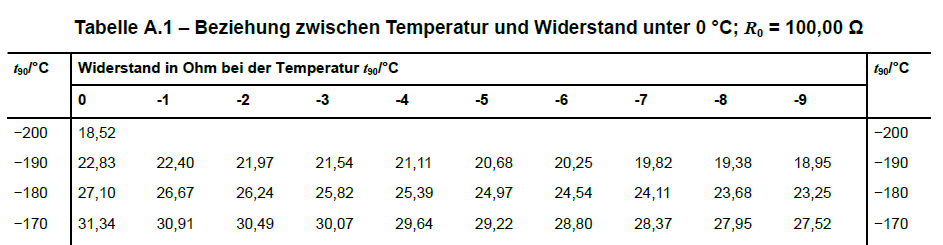

# Calibration
The accuracy of measurements is improved by correcting systematic measurement deviations. In this chapter, typical *types of errors* in measurements and practical calibration methods are introduced:

  - additive errors,
  - multiplicative errors, and
  - nonlinearity.

In this section, we use the established terminology, even though the errors would more precisely be described as systematic measurement deviations.

```{python}
#| echo: false

# Load modules
import numpy as np
import numpy.polynomial.polynomial as poly
import pandas as pd
import matplotlib.pyplot as plt
```

**As an exercise, use cooked ice. (You have to use the zero point and 100 degrees as reference values). The problem is that cooking ice is also nonlinear (above 50 °C). Note that you do not have a reference value for the zero point (which lies at −273 °C), so you have to estimate it using linear regression. Presumably, it is not necessary to convert to Kelvin because of the absolute shift. → We have already shown for the calculation without measurement values for the zero point that no shift is required.**

  - But does this also apply to temperature sensors that cannot measure down to absolute zero at all? Perhaps by conceptualizing the lower limit of the measurement range as the zero point.
  - The nonlinearity is not an error of the sensor system, but a physical effect. How do we deal with this? → One could say that the effect is approximated via the linearly estimated span error. Between the nonlinear measurement curve and the linearly estimated span error, a linearity error then arises.

**The problem is that the data must be cleaned without interpolating or smoothing it → work with a linear trend and standard deviation, or refer to the module on data fitting and data optimization.**

## Calibration and Adjustment
The correction of systematic measurement deviations can be carried out in two ways: by calibration or by adjustment of the measuring instrument.

In the narrower sense, the term calibration refers to the determination of the relationship between measured values or their arithmetic mean and the agreed correct value of the measurand.

::: {#imp-calibration1 .callout-important}
## Calibration according to DIN 1319

"Determination of the relationship between measured values [...] or expected value [...] of the output quantity [...] and the associated true [...] or correct value [...] of the measurand present as the input quantity for a given measuring device [...]." [@DIN1319-1, p. 22]
:::

In a broader sense, calibration also means "the creation of a correction table [...], the determination of calibration factors or a (empirical) calibration function" [@DIN1319-1, p. 22]. These are methods used to correct measurement values affected by systematic measurement deviations without changing the measuring instrument.

In contrast, adjustment permanently changes the measuring instrument.

::: {#imp-adjustment .callout-important}
## Adjustment according to DIN 1319

"Setting or aligning a measuring instrument [...], in order to eliminate systematic measurement deviations [...] as far as required for the intended application." [@DIN1319-1, p. 22]
:::

## Calibration Methods According to DIN 1319
DIN 1319 lists three calibration methods, which are only briefly discussed here:

1. Correction table,
2. Determination of calibration factors, and
3. Determination of a (empirical) calibration function.

Which method is used depends on the field of application, the availability of data, and the desired accuracy.

| Method                   | Application for …                 | Advantages                       | Disadvantages                                |
| ------------------------ | --------------------------------- | -------------------------------- | -------------------------------------------- |
| **Correction table**     | nonlinear, difficult to model     | easy to use                      | many data points required, otherwise interpolation inaccurate |
| **Calibration factors**  | linear deviation                  | easy to implement                | insufficient for nonlinearity               |
| **Calibration function** | nonlinear, modelable              | very accurate                    | higher effort                               |

### Correction Table
A correction table can represent arbitrary corrections, provided that sufficient data points are available. In @sec-pt100 we will learn about an example of a correction table.

### Determination of Calibration Factors
A calibration factor can be specified when a constant relative deviation is present. A practical example can be found [here on page 1](https://www.lanuk.nrw.de/fileadmin/lanuv/luft/immissionen/ber_trend/Aequivalenznachweis/AEquivalenztest_und_Faktorenbestimmung_2023.pdf).

### Determination of a (Empirical) Calibration Function
A calibration function allows the modeling of complex relationships. The methods for this are presented in the [module Data Fitting and Data Optimization](https://bausteine-der-datenanalyse.github.io/m-datenfitting-und-optimierung/output/book/).

## Additive Errors: The Zero Offset Error
The zero offset error describes the deviation of the measured quantity from zero when the true value is actually zero. The zero offset error is also referred to as zero adjustment error, zero shift, or offset error. The zero offset error is constant and acts additively on every measured value. ([ICS Schneider Messtechnik](https://www.ics-schneider.de/wie-wirken-sich-nullpunktfehler-spannfehler-und-nichtlinearitaet-auf-die-genauigkeit-von-drucksensoren-aus/))

```{python}
#| fig-alt: "Schematic illustration of the zero offset error. Two parallel lines of the true and measured values are connected at the point x = 0 by a dashed vertical line that highlights the difference between the true value y = 2 and the measured value y = 6. The dashed line is drawn again at x = 4 and x = 8."

# Generate data
measured_quantity = np.arange(0, 11)
measured_values = measured_quantity + 4

# Plot
plt.plot(measured_quantity, marker='o', label='true value')
plt.plot(measured_values, marker='^', label='measured value')
plt.plot([0, 0], [measured_quantity[0], measured_values[0]], linestyle='dashed', label='zero offset error', color='red')
plt.plot([4, 4], [measured_quantity[4], measured_values[4]], linestyle='dashed', color='red')
plt.plot([8, 8], [measured_quantity[8], measured_values[8]], linestyle='dashed', color='red')

# Axis labels
plt.xlabel('Index')
plt.ylabel('Feature value')

plt.legend()
plt.show()
```

&nbsp;

### Quantifying the Zero-Offset Error
**The calculations here are not yet correct. With simple values it seems to work by chance, but with shifted values it no longer does. The correct approach is shown in the test using Kelvin.**

The zero-offset error can be easily determined if measurement values for the zero point are available and the true value is known. (If it is also known that no further systematic measurement deviations are present, the zero-offset error can be determined using any true reference value.) This is the case for the data created for graphical representation.

```{python}
print(f"The zero-offset error is: {measured_values[0] - measured_quantity[0]}")
```

If no data for the zero point is available, the zero-point error can be estimated using linear regression from at least two known reference points. This involves estimating an ideal calibration curve and determining its intersection with the y-axis. Likewise, a linear function is estimated for the measured values. The difference between the y-axis intercepts gives an estimate of the zero-point error.
```{python}
# known reference points

x1 = 4
x2 = 8
y1 = measured_quantity[x1]
y2 = measured_quantity[x2]

# estimate ideal calibration curve

# print(linear_model) returns intercept + slope

lm_curve = poly.polyfit(x = [x1, x2], y = [y1, y2], deg = 1)
print("The first value is the intersection of the ideal calibration curve with the y-axis:", lm_curve.round(2), sep = "\n")

# estimate linear function for the measured values

## at least 2 points are needed

lm_measurements = poly.polyfit(x = [x1, x2], y = [measured_values[x1], measured_values[x2]], deg = 1)
print("Linear function estimated from 2 measured values:", lm_measurements.round(2), sep = "\n")

## estimation using all measured values is more reliable

lm_measurements_all = poly.polyfit(x = np.arange(measured_values.size), y = measured_values, deg = 1)
print("Linear function estimated from all measured values:", lm_measurements_all.round(2), sep = "\n")

print("\nThe difference between the estimated zero-point of the measured values and the\nestimated zero-point of the ideal calibration curve is the zero-point error:", (lm_measurements[0] - lm_curve[0]).round(2), sep = "\n")
```

The procedure is illustrated graphically.
```{python}
#| fig-alt: A dashed line runs from the intersection of the axes through two reference points. This dashed line represents the ideal characteristic curve. A parallel line runs through the measured values. The distance between the two lines is constant over the value range and corresponds to the zero-point error.

# calculate linear functions

estimated_ideal_curve = poly.polyval(x = np.arange(measured_values.size), c = lm_curve)
linear_function_measurements = poly.polyval(x = np.arange(measured_values.size), c = lm_measurements)

# plotting

## points

plt.plot([x1, x2], [y1, y2], marker = 'o', linestyle = 'none', color = 'C0', label = 'known reference values')
plt.plot([x1, x2], [measured_values[x1], measured_values[x2]], marker = '^', linestyle = 'none', color = 'C1', label = 'measurements at reference points')

## lines

plt.plot(np.arange(measured_values.size), estimated_ideal_curve, marker = 'none', linestyle = 'dashed', color = 'C0', label = 'ideal curve')
plt.plot(np.arange(measured_values.size), linear_function_measurements, marker = 'none', linestyle = 'dashed', color = 'C1', label = 'linear function of measurements')

plt.plot([0, 0], [measured_quantity[0], measured_values[0]], linestyle = 'dashed', label = 'zero-point error', color = 'red')
plt.plot([4, 4], [measured_quantity[4], measured_values[4]], linestyle = 'dashed', color = 'red')
plt.plot([8, 8], [measured_quantity[8], measured_values[8]], linestyle = 'dashed', color = 'red')

plt.legend()
plt.show()
```

**Are there other methods?**

### Correcting the zero-point error
The zero-point error is corrected by subtracting it from the measured values. The procedure for determining the zero-point error is illustrated in the following example with different values.

```{python}
# Generate data
measured_quantity = np.arange(0, 11) + 5
measured_values = measured_quantity + 2.5

# known reference points
x1 = 2
x2 = 5
y1 = measured_quantity[x1]
y2 = measured_quantity[x2]

# estimate ideal characteristic line
ideal_line = poly.polyfit(x = [x1, x2], y = [y1, y2], deg = 1)

# estimate linear function of the measurements
## estimation over all measurements is more reliable
measured_line = poly.polyfit(x = np.arange(measured_values.size), y = measured_values, deg = 1)

# determine zero-point error
zero_point_error = measured_line[0] - ideal_line[0]
print(f"The zero-point error is: {zero_point_error.round(2)}")

# correct zero-point error
corrected_measurements = measured_values - zero_point_error
```

### Exercise: Zero-Point Error
**Andres' bike sensor always measures 3 degrees too high because the display generates heat (offset error). Here are the values with the display off and the known reference values.**

## Multiplicative Error: Span Error
**Span error seems to be a rarely used term.**

A span error is an error that increases or decreases over the measurement range (the span) of the quantity being measured. The relative measurement deviation $\delta$ remains constant, while the absolute measurement deviation $\Delta$ depends on the measured value. ([ics Schneider Messtechnik](https://www.ics-schneider.de/wie-wirken-sich-nullpunktfehler-spannfehler-und-nichtlinearitaet-auf-die-genauigkeit-von-drucksensoren-aus/))

``` {python}
#| fig-alt: "Schematic illustration of the span error. Two lines representing the true and measured values start from a common zero point and diverge to the right, increasing their distance. The area between the lines is shaded, highlighting the span error."

# Generate data
measured_quantity = np.arange(0, 11)
measured_values = measured_quantity - measured_quantity / 3

# Plot
plt.plot(measured_quantity, marker='o', label='true value')
plt.plot(measured_values, marker='^', label='measured value')

# Fill area
plt.fill_between(x=np.arange(measured_values.size), y1=measured_quantity, y2=measured_values, alpha=0.2, label='span error')

# Axis labels
plt.xlabel('Index')
plt.ylabel('Feature Value')

plt.legend()
plt.show()
```

### Quantifying Span Error
The span error can be estimated if reference values are known. With the complete example data, it’s straightforward (in this example, a warning due to division by 0 is suppressed):

```{python}
#| warning: false

print(f"The span error is: {round((np.nanmean((measured_values / measured_quantity)) - 1 ) * 100, 2)} %")
```

For sparse data points, an ideal curve is estimated to approximate the span error.
```{python}
# known reference values

x1 = 4
x2 = 8
y1 = measured_quantity[x1]
y2 = measured_quantity[x2]

# estimate ideal curve

lm_curve = poly.polyfit(x=[x1, x2], y=[y1, y2], deg=1)
estimated_ideal_curve = poly.polyval(x=np.arange(measured_values.size), c=lm_curve)

# linear regression of the measurements

lm_measurements = poly.polyfit(x=np.arange(measured_values.size), y=measured_values, deg=1)

# output

print(f"Slope of the measurements: {round(lm_measurements[1], 2)}")
print(f"Slope of the ideal curve: {round(lm_curve[1], 2)}")
```

The procedure is illustrated graphically.
```{python}
#| fig-alt: A dashed line runs from the intersection of the axes through two reference points. This dashed line represents the ideal characteristic curve. Another line connects the measured values. The distance between the two lines increases across the range. The area between the lines is color-filled to indicate the span error.

# Points and lines

plt.plot([0, 10], [measured_quantity[0], measured_quantity[-1]], marker='none', linestyle='dashed', color='C0', label='ideal characteristic curve')
plt.plot([x1, x2], [y1, y2], marker='o', linestyle='none', color='C0', label='known reference values')
plt.plot(measured_values, marker='^', color='C1', label='measured values')

# fill

plt.fill_between(x=np.arange(measured_values.size), y1=measured_quantity, y2=measured_values, alpha=0.2, label='span error')

plt.legend()
plt.show()
```

### Correcting Span Error
The span error is corrected by dividing the measured values by 1 plus the span error. The procedure for determining the span error is illustrated in the following example with different values.

```{python}
# Generate data
measured_quantity = np.arange(0, 11) + 5
measured_values = measured_quantity - measured_quantity / 5

# Known reference points
x1 = 2
x2 = 5
y1 = measured_quantity[x1]
y2 = measured_quantity[x2]

# Estimate ideal characteristic line
ideal_line = poly.polyfit(x=[x1, x2], y=[y1, y2], deg=1)

# Estimate linear function of measured values
measured_line = poly.polyfit(x=np.arange(measured_values.size), y=measured_values, deg=1)

# Determine span error
span_error = measured_line[1] - ideal_line[1]
print(f"The span error is: {((measured_line[1] - ideal_line[1]) * 100).round(2)} %")

# Correct span error
corrected_values = measured_values / (1 + span_error)

print(f"True values:\n{measured_quantity}")
print(f"Measured values:\n{measured_values}")
print(f"Corrected measured values:\n{corrected_values}")
```

### Exercise: Span Error
**to do**

## Zero-Point and Span Errors
Absolute and multiplicative deviations can occur simultaneously. In this example, the absolute measurement deviation decreases over the displayed value range, because the zero-point error has a positive sign and the span error has a negative sign.

```{python}
#| fig-alt: "Schematic representation of a measurement series with zero-point and span errors. Two lines of the true and measured values run from left to right with decreasing distance and are connected at x = 0 by a dashed line (zero-point error). The area between the lines is filled – this indicates the span error."

# Generate data
measured_quantity = np.arange(0, 11)
measured_values = measured_quantity + 4 - measured_quantity / 3

# Plot
plt.plot(measured_quantity, marker='o', label='true value')
plt.plot(measured_values, marker='^', label='measured value')
plt.plot([0, 0], [measured_quantity[0], measured_values[0]], linestyle='dashed', label='zero-point error')

# Fill span error
span_error_line = measured_values - 4
plt.fill_between(x=np.arange(measured_values.size), y1=measured_quantity, y2=span_error_line, alpha=0.2, label='span error')

# Show zero-point error at specific points
plt.plot([4, 4], [span_error_line[4], measured_values[4]], linestyle='dashed', color='red')
plt.plot([8, 8], [span_error_line[8], measured_values[8]], linestyle='dashed', color='red')

# Axis labels
plt.xlabel('Index')
plt.ylabel('Feature value')

plt.legend()
plt.show()
```

&nbsp;

### Quantifying Zero-Point and Span Errors
Using at least two known reference points, the zero-point and span errors can be estimated with linear regression. In linear regression, an index starting at 0 is used for the x-values. To correctly determine the zero-point error, this index is shifted by the estimated true zero point.

This is necessary because if the measured quantity does not include a value for 0, the span error would also be applied to the value at index 0. Therefore, the span error must be corrected first.  
(**If the values include 0, this step is not noticeable.**)

```{python}
# Generate data
measured_quantity = np.arange(0, 11) + 7
measured_values = measured_quantity + 4 - measured_quantity / 3

# Known reference points
x1 = 4
x2 = 8
y1 = measured_quantity[x1]
y2 = measured_quantity[x2]

# Estimate ideal characteristic line
lm_characteristic = poly.polyfit(x = [x1, x2], y = [y1, y2], deg = 1)
print(f"lm_characteristic: {lm_characteristic}")

# Linear regression of measurements
lm_measurements = poly.polyfit(x = np.arange(measured_values.size), y = measured_values, deg = 1)

# Linear regression of measurements plus y-intercept of ideal characteristic line
lm_measurements_plus_intercept = poly.polyfit(np.arange(measured_values.size) + lm_characteristic[0], measured_values, 1)

# Determine zero-point error
zero_point_error = lm_measurements_plus_intercept[0]
print(f"The zero-point error is: {zero_point_error.round(2)}")

# Determine span error
span_error = lm_measurements[1] - lm_characteristic[1]
print(f"The span error is: {((lm_measurements[1] - lm_characteristic[1]) * 100).round(2)} %")
```

Graphical Representation
**to-do**
```
# Optional: graphical representation
# estimated_ideal_curve = poly.polyval(x = np.arange(measured_values.size), c = lm_curve)
```

### Correcting Zero-Point and Span Errors

The order of correction matters.

1. First, the zero-point error is corrected.
2. Then, the span error is corrected.
```{python}
# Generate data

measured_quantity = np.arange(0, 11) + 7
measured_values = measured_quantity + 4 - measured_quantity / 3

# known reference points

x1 = 4
x2 = 8
y1 = measured_quantity[x1]
y2 = measured_quantity[x2]

# Output

print(f"True values:\n{measured_quantity}")
print(f"Measurements:\n{measured_values}")
print()

# first correct zero-point error, then span error

## Correct zero-point error

corrected_measurements = measured_values - zero_point_error

## Correct span error

corrected_measurements = corrected_measurements / (1 + span_error)

print(f"Zero-point corrected first, then span error corrected\n{corrected_measurements}")

# first correct span error, then zero-point error

## Correct span error

corrected_measurements = measured_values / (1 + span_error)

## Correct zero-point error

corrected_measurements = corrected_measurements - zero_point_error

print(f"Span error corrected first, then zero-point error corrected\n{corrected_measurements}")
print()

# Arnold's approach

true_minimum = measured_quantity.min()
true_maximum = measured_quantity.max()

a = (true_maximum - true_minimum) / (measured_values.max() - measured_values.min())
b = true_minimum - a * measured_values.min()

corrected_measurements = a * measured_values + b

print(f"Arnold's approach\n",
f"a = {a:.1f}\n",
f"b = {b:.1f}\n",
f"\na * measurements + b\n{corrected_measurements}",
sep = '')
```

Simone's approach leads to correctly calibrated measurements. The variable `a` is the correction factor for the span error. However, the variable `b` has no intrinsic meaning. But why does it work then?! Because `b` represents the zero-point correction when the span error is corrected first.

This has to do with the structure of the data and the correction. `b` is the correction of the zero-point error * span error. This means that from the Arnold formula, the span error can be calculated as $-1 * {b \over a}$.

My approach is more flexible because it can estimate the correction from arbitrary points, rather than just the minimum and maximum.

## Nonlinearity: Linearity Error

### Example Pt100 {#sec-pt100}
The Pt100 is a platinum resistance thermometer (Pt = Platinum) with a defined resistance of $100 \Omega$ at a temperature of 0°C (hence the name Pt**100**). The resistance of a Pt100 increases with temperature. At 100 °C, for example, the resistance is $138.51 \Omega$. However, the relationship between the input quantity, the electrical resistance, and the measured temperature is only approximately linear.

The characteristics of a Pt100 resistor are specified in the standard DIN EN IEC 60751 [@DIN60751]. The relationship is described by two polynomials: one for the temperature range from -200 °C to 0 °C, and one for 0 °C to 850 °C.

For the temperature range –200 °C to 0 °C:
$$
R_T = R_0 \cdot \left(1 + A \cdot T + B \cdot T^2 + C \cdot (T - 100 ^\circ\text{C}) \cdot T^3\right)
$$

For the temperature range 0 °C to +850 °C:
$$
R_T = R_0 \cdot \left(1 + A \cdot T + B \cdot T^2\right)
$$

Where:

  - $R_T$ is the resistance at temperature $T$,
  - $R_0$ is the resistance at $0^\circ\text{C}$,
  - $A$, $B$, and $C$ are constants describing the sensor's specific characteristics. Specifically:

      - $A = 3.9083 \times 10^{-3} ~ {^\circ\text{C}}^{-1}$
      - $B = -5.775 \times 10^{-7} ~ {^\circ\text{C}}^{-2}$
      - $C = -4.183 \times 10^{-12} ~ {^\circ\text{C}}^{-4}$

[@DIN60751, p. 13]

The appendix of the standard contains tables showing the relationship between temperature and measured resistance. The table format allows quickly determining the measured temperature from a measured resistance value. The first column lists temperatures in tens of degrees, while the next ten columns represent the unit digits. For temperatures below zero, the unit digit is subtracted (indicated by the negative sign $-$), and for temperatures above zero, it is added (indicated by the positive sign $+$). A consolidated version can be found, for example, [here](https://s8b8d6a7.delivery.rocketcdn.me/wp-content/uploads/2022/08/Pt100-Tabelle-Screen.pdf).

{#fig-pt100 fig-alt="Excerpt from Table A.1. For temperatures from -200 to -170 degrees Celsius, the resistance values measured by a Pt100 are listed in 1-degree steps."}

[@DIN60751, p. 25]

The notation $t_{90} / °C$ is based on the International Temperature Scale ITS-90 of 1990, which defines temperatures $T_{90}$ in Kelvin and $t_{90}$ in degrees Celsius. The notation indicates that the table values are in degrees Celsius. (@DIN60751, p. 10)

### Task: Reading the Pt100 Table
For data analysis, the tabular format is less suitable. The [consolidated version](https://s8b8d6a7.delivery.rocketcdn.me/wp-content/uploads/2022/08/Pt100-Tabelle-Screen.pdf) was copied into two CSV files. Read the files so that the electrical resistance and temperature each form ascending sequences (e.g., as a list, NumPy array, or a Pandas data structure). The file paths are:

``` {raw}
'skript/01-daten/pt100-table-below-zero.csv'
'skript/01-daten/pt100-table-above-zero.csv'
```

::: {#tip-pt100 .callout-tip collapse="true"}
## Read Sample Solution Pt100 Table
``` {python}
file_path_below_zero = '01-daten/pt100-table-below-zero.csv'
file_path_above_zero = '01-daten/pt100-table-above-zero.csv'
```

Import and view files. First, the file with temperatures below 0 degrees Celsius.
```{python}
# below_zero

below_zero = pd.read_csv(filepath_or_buffer = file_path_below_zero, sep = ',')

print(below_zero.head(), "\n")
print(below_zero.tail())
```

There are 201 values (from -200 to 0). The data starts at the row with index 1 (if the first row is read as header). This row contains only one entry in column '0'. The following rows should be read from right to left. The decimal separator is `,`. 

Reading the data from right to left can be done in many ways. A one-line solution starts by passing a negative step size to the method `pd.iloc[::-1]`.

```{python}
df = pd.DataFrame(np.array([[3, 2, 1], [6, 5, 4]]))
print(df, "\n")
print(df.iloc[::-1])
```

This causes the *rows* of the DataFrame to be displayed in reverse order. To display the *columns* in reverse order, the DataFrame is transposed twice using the `pd.T` method.
``` {python}
print(df.T.iloc[::-1].T)
```

The NumPy method `np.flatten()` can be used to reduce an array to a one-dimensional structure. To do this, the DataFrame is converted to a NumPy array using the `pd.to_numpy()` method.
```{python}
print(df.T.iloc[::-1].T.to_numpy())
print() # empty line
print(df.T.iloc[::-1].T.to_numpy().flatten())
```

Let's try looking at the head of the Pt100 data.

```{python}
below_zero = pd.read_csv(filepath_or_buffer=file_path_below_zero, sep=',', decimal=',', header=0, skiprows=1, index_col=0)

print(below_zero.head())
print()  # empty line
print(below_zero.head().T.iloc[::-1].T.to_numpy().flatten())
```

To skip the missing values, we convert the current result back into a `pd.Series()` and use the `pd.Series.dropna()` method.
```{python}
pd.Series(below_zero.head().T.iloc[::-1].T.to_numpy().flatten()).dropna()
```

And now for the entire file:
```{python}
below_zero_ohm = pd.Series(below_zero.T.iloc[::-1].T.to_numpy().flatten()).dropna()
print(below_zero_ohm.head(), below_zero_ohm.tail(), sep = '\n')
```

We can simply generate the temperature using a range object
```{python}
below_zero_temperature = pd.Series(range(-200, 1))  # range stop is exclusive
print(below_zero_temperature.head(), below_zero_temperature.tail(), sep='\n')
```

For temperatures above 0 degrees, the procedure can be simplified, since the file has the same structure and the values are sorted in ascending order.
```{python}
above_zero = pd.read_csv(filepath_or_buffer = file_path_above_zero, sep = ',', decimal = ',', header = 0, skiprows = 1, index_col = 0)

above_zero_ohm = pd.Series(above_zero.to_numpy().flatten()).dropna()
print(above_zero_ohm.head(), above_zero_ohm.tail(), sep = '\n')
```

Both datasets contain an entry for 0 degrees, so it can be removed from the second file
```{python}
above_zero_ohm = above_zero_ohm[1:]
print(above_zero_ohm.head(), above_zero_ohm.tail(), sep='\n')
```

The temperature is generated again using a range object.
```{python}
abovezero_temperature = pd.Series(range(1, 851))  # range stop is exclusive
```

The Series generated from both datasets can be combined:
```{python}
pt100 = pd.DataFrame({
'Temperature': pd.concat([below_zero_temperature, abovezero_temperature], ignore_index=True),
'Ohm': pd.concat([below_zero_ohm, above_zero_ohm], ignore_index=True)
})

# Show the first and last rows of the combined DataFrame

print(pt100.head(), pt100.tail(), sep='\n')

# Display information about the DataFrame

print(pt100.info())
```

:::

### Representing Nonlinearity
Using the data from @tip-pt100, the nonlinearity of the sensor can be visualized.

```{python}
#| fig-alt: "Plot of temperature in degrees Celsius on the x-axis and electrical resistance in Ohm on the y-axis"

plt.plot(pt100['Temperature'], pt100['Ohm'], marker='o', linestyle='', label='electrical resistance', alpha=0.6)
plt.plot([pt100['Temperature'].iloc[0], pt100['Temperature'].iloc[-1]],
         [pt100['Ohm'].iloc[0], pt100['Ohm'].iloc[-1]],
         linewidth=2, label='reference line')
plt.yticks(pt100['Ohm'][::50])

plt.xlabel('Temperature in °C')
plt.ylabel('Electrical resistance in Ohm')
plt.grid()
plt.legend()

plt.show()
```

&nbsp;

It is noticeable that the data contains a missing value. The position of the missing value is determined using two Pandas methods. `pd.diff()` returns the difference between each value and its predecessor. `pd.idxmin()` returns the row index (specifically the label) of the smallest value. (If the missing value were above the line, `pd.idxmax()` would be used.)
```{python}
# := is the so-called walrus operator
print(( missing_value_position := pt100['Ohm'].diff().idxmin() ))
print(pt100.iloc[list(range(missing_value_position - 2, missing_value_position + 3))])
```

The correct value can be read from the DIN standard [@DIN60751, p. 26] (153.96). However, the value can also be interpolated (see example).

::: {#nte-interpolate .callout-note collapse="true"}
## Interpolation
The simplest form of interpolation is linear interpolation. 

```{python}
interpolate_values = pt100.loc[missing_value_position - 1 : missing_value_position + 1, 'Ohm'].copy()
interpolate_values[missing_value_position] = np.nan
print(interpolate_values, "\n")

print("linearly interpolated value:", interpolate_values.interpolate(), sep="\n")
```

Rounding produces the correct result (but one should not rely on it)
```{python}
print("linearly interpolated value:", interpolate_values.interpolate().round(2), sep = "\n")
correct_value = interpolate_values.interpolate().round(2)[missing_value_position]
```

Another option is nonlinear interpolation (which is not the focus of this module). 

:::: {#nte-nonlinear .callout-note collapse="true"}
## Nonlinear Interpolation

Nonlinear interpolation requires more data points. Let's try cubic interpolation:
```{python}
interpolate_values_again = pt100.loc[missing_value_position - 3 : missing_value_position + 4, 'Ohm'].copy()
interpolate_values_again[missing_value_position] = np.nan
print("polynomial interpolated value:", interpolate_values_again.interpolate(method = 'polynomial', order = 3), sep = "\n")
```

The result is less accurate. You can learn why in the [Data Fitting and Optimization Methods Module](https://bausteine-der-datenanalyse.github.io/m-datenfitting-und-optimierung/output/book/).

::::
:::

The missing value (whose position is determined in the example above) is corrected:
```{python}
pt100.loc[missing_value_position, 'Ohm'] = correct_value
print(pt100.loc[missing_value_position - 1 : missing_value_position + 1, 'Ohm'])
```

The nonlinearity can then be represented again:
```{python}
#| fig-alt: "Plot of temperature in degrees Celsius on the x-axis and electrical resistance in Ohm on the y-axis"

plt.plot(pt100['Temperature'], pt100['Ohm'], marker='o', linestyle='', label='electrical resistance', alpha=0.6)
plt.plot([pt100['Temperature'].iloc[0], pt100['Temperature'].iloc[-1]],
[pt100['Ohm'].iloc[0], pt100['Ohm'].iloc[-1]],
linewidth=2, label='reference line')
plt.yticks(pt100['Ohm'][::50])

plt.xlabel('Temperature in °C')
plt.ylabel('Electrical resistance in Ohm')
plt.grid()
plt.legend()

plt.show()
```

### Quantifying Nonlinearity
Two methods for quantifying nonlinearity are the fixed-point method and the tolerance band method.

#### Fixed-Point Method

::: {#imp-fixed-point-method .callout-important}
## Fixed-Point Method
The endpoints of the actual characteristic curve are connected by a straight line. The linearity error is the maximum deviation of the characteristic curve from this line. [@Dubbel2011, pp. W2-W3 (pp. 1661-1662)]
:::

First, we determine the predicted values of a line defined by the endpoints.
```{python}
#| fig-alt: "Plot of temperature in degrees Celsius on the x-axis and electrical resistance in Ohm on the y-axis"

lm = poly.polyfit(
  x = [pt100['Temperature'].iloc[0], pt100['Temperature'].iloc[-1]],
  y = [pt100['Ohm'].iloc[0], pt100['Ohm'].iloc[-1]],
  deg = 1)
print(lm.round(2)) # intercept + slope

predicted_values = poly.polyval(x = pt100['Temperature'], c = lm)

plt.plot(pt100['Temperature'], pt100['Ohm'], marker = 'o', linestyle = '', label = 'Electrical Resistance', alpha = 0.6)
plt.plot(pt100['Temperature'], predicted_values, linewidth = 2, label = 'Predicted values from endpoint line')
plt.yticks(pt100['Ohm'][::50]);

plt.xlabel('Temperature in °C')
plt.ylabel('Electrical Resistance in Ohm')
plt.grid()
plt.legend()

plt.show()
```

&nbsp;

The maximum linearity error can be determined from the difference between the measured electrical resistance and the linear predicted values.
```{python}
linearity_error = (pt100['Ohm'] - predicted_values).abs().max()
print(f"Linearity error using fixed-point method: {linearity_error:.2f} Ohm.")
```

#### Tolerance Band Method

::: {#imp-tolerance-band-method .callout-important}
## Tolerance Band Method
In the tolerance band method, a line is fitted through the measurement points such that either the sum of the squared deviations of the points from this line (least squares method) or the largest single deviation ([Chebyshev approximation](https://en.wikipedia.org/wiki/Chebyshev_polynomials)) is minimized. The size of the linearity error is the maximum vertical distance of the characteristic curve from this fit line. [@Dubbel2011, p. W3 (p. 1662)]
:::

We have already learned the principle of the least squares method.
```{python}
#| fig-alt: "Plot of temperature in degrees Celsius on the x-axis and electrical resistance in Ohm on the y-axis"

lm = poly.polyfit(
  x = pt100['Temperature'],
  y = pt100['Ohm'],
  deg = 1)
print(lm.round(2)) # intercept + slope

predicted_values = poly.polyval(x = pt100['Temperature'], c = lm)

plt.plot(pt100['Temperature'], pt100['Ohm'], marker = 'o', linestyle = '', label = 'Electrical Resistance', alpha = 0.6)
plt.plot(pt100['Temperature'], predicted_values, linewidth = 2, label = 'Regression Line')
plt.yticks(pt100['Ohm'][::50]);

plt.xlabel('Temperature in °C')
plt.ylabel('Electrical Resistance in Ohm')
plt.grid()
plt.legend()

plt.show()
```

&nbsp;

The maximum linearity error (i.e., the largest residual) can be determined from the difference between the measured electrical resistance and the linear predicted values.
```{python}
linearity_error = (pt100['Ohm'] - predicted_values).abs().max()
print(f"Linearity error according to the tolerance band method: {linearity_error:.2f} Ohm.")
```

**Problem: The Tolerance Band Method Produces a Zero-Point Error**

## Types of Errors and Practical Calibration Methods

### Nonlinearity
In an ideal measurement, the value of interest depends linearly on the measured value. Many analog sensors, due to material properties or temperature dependence, respond nonlinearly to the measured quantity. This means that the measured values are not directly proportional to the physical quantity being measured. This so-called **linearity error** must be corrected in order to achieve accurate measurements.  

There are two main approaches. One is to use nonlinear parameter estimation methods, which are covered in the [Data Fitting and Optimization Methods Module](https://bausteine-der-datenanalyse.github.io/m-datenfitting-und-optimierung/output/book/). The other is to correct the linearity error so that simpler linear parameter estimation methods can be used. Correction of linearity errors is the focus of this chapter.

## Other
Hysteresis: Delay between the change of the input value and the response speed of the measured value  
Drift: Slow change of sensor output over time  
Noise: Random fluctuations in sensor output  

## Occurrence Together with Nonlinearity

## Residual Ramp

(Additional error sources: [Hysteresis](https://en.wikipedia.org/wiki/Hysteresis), Drift, Noise, or Zero-Point Shift)

Methods for Correction: Where is the variable transformation needed for linear parameter estimation?

1. **Creating a Calibration Curve/Table:** The sensor is measured at a series of known reference values (calibration points). These points are used to create an individual curve or table that represents the actual behavior of the sensor.

2. **Applying Mathematical Corrections:**

   - **Nonlinear Regression:** A function (e.g., a polynomial) is fitted to the calibration data. The difference between the measured values and the function is minimized to achieve the best possible fit. This method is shown in the [Data Fitting and Optimization Methods Module](https://bausteine-der-datenanalyse.github.io/m-datenfitting-und-optimierung/output/book/).

   - **Specific Coefficients:** Certain sensor types have standard models with specialized coefficients.

      - ITS-90 and Callendar–van Dusen coefficients: For the calibration of platinum sensors.  
      - Steinhart–Hart coefficients: A common method for thermistors to calculate temperature.

A sufficient number of calibration points should be collected across the entire measurement range to accurately represent the nonlinearity.

**Error Compensation:** By applying these corrections, zero-point and span errors are also addressed, improving the accuracy of the sensor across its full measurement range.