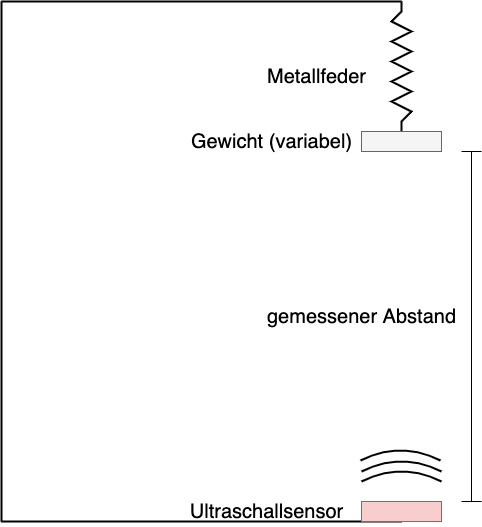

# Linear Parameter Estimation {#sec-hooke}

Many physical quantities are measured indirectly. Frequently, there is a linear relationship between the measured quantity and the desired quantity. In practice, the data of a measurement series are never exact and are affected by more or less significant deviations from the true value of the desired quantity. Linear parameter estimation is a method used to determine, from a set of data, the value that minimizes the deviations of individual measured values.

Possible sources:

  - https://messtechnik-und-sensorik.org/2-kennlinien-und-messgenauigkeit/  
  - https://www.stssensors.com/de/characteristic-curve-hysteresis-measurement-error-terminology-in-pressure-measurement-technology/ 

## Measurement Series: Hooke’s Law
[Hooke’s law](https://en.wikipedia.org/wiki/Hooke%27s_law), named after the English scientist Robert Hooke, describes the relationship between the force $F$ and the change in length $\Delta x$ of a spring by the equation  
$F = k \cdot \Delta x$,  
where $k$ is the spring constant.

The spring constant is a fundamental property of elastic materials and indicates how much force is required to stretch or compress a spring by a certain length. Hooke’s law states that the deformation of an elastic body is proportional to the applied force, as long as the spring is not stretched or compressed beyond its elastic range.

In an experiment, Hooke’s law was tested. A metal spring hanging from a mount has a (variable) weight attached. Below it, at some distance, an ultrasonic sensor is placed for distance measurement. The distance between the underside of the weight attached to the spring and the ultrasonic sensor is the measured distance.

The weights were determined with an accuracy of $\epsilon_{m} = 0.5\ \mathrm{g}$ using a kitchen scale.

```{python}
#| echo: false

import numpy as np
import numpy.polynomial.polynomial as poly
import pandas as pd
import matplotlib.pyplot as plt
import scipy
import glob
```

{fig-alt="Illustration of the experimental setup."}

The measurement series is provided as a CSV file located at the path `01-daten/hooke_data.csv`. The file is read using Pandas.

```{python}
file_path = "01-daten/hooke_data.csv"
hooke = pd.read_csv(filepath_or_buffer=file_path, sep=';')
```

### Descriptive Statistics
After loading the data, you should get an overview of it. With the methods `pd.DataFrame.head()` and `pd.DataFrame.tail()` you can view a snippet from the beginning and the end of the dataset.
```{python}
print(hooke.head(), "\n")
print(hooke.tail())
```

The method `pd.DataFrame.describe()` generates descriptive statistics for the dataset.  
In this case, however, the output is not particularly useful yet.  
The column 'no' contains only a running experiment number, and the column 'mass' contains different weights.

```{python}
hooke.describe()
```

&nbsp;

It is more useful to have a descriptive statistic of the measured extension, grouped by the applied weight. For this, the Pandas method `pd.DataFrame.groupby()` can be used. This way, the arithmetic mean and standard deviation can be read for each of the measured weights.

```{python}
hooke.groupby(by='mass')['distance'].describe()
```

&nbsp;

Even at this point, the high standard deviation in the measurement series with 0 grams could be noticeable. It is, however, easier to spot when looking at the graphical representation.

```{python}
#| fig-alt: "Plot of the weight on the x-axis and the measured distance on the y-axis."

hooke.plot(x='mass', y='distance', kind='scatter', title="Hooke's Law Measurement Series", ylabel='Distance in cm', xlabel='Weight in grams', label='Measured distance')
plt.legend()

plt.show()
```

&nbsp;

Graphically, the measurement of 200 cm for the weight 0 grams stands out as strongly deviating from the other measurements.

The measurements for the weight 0 grams will be examined more closely. For this purpose, the values are displayed both in absolute terms and [standardized in units of the standard deviation (z-scores)](https://en.wikipedia.org/wiki/Standard_score).

A variable is standardized by subtracting the mean from each value and dividing the result by the standard deviation.

$$
Z = \frac{x - \mu}{\sigma}
$$

Since the population mean and standard deviation are usually unknown, the sample mean and sample standard deviation are used instead. This procedure is called *studentization*, named after the pseudonym of William Sealy Gosset, who was mentioned in the previous chapter.

$$
z_{i} = \frac{x_{i} - \bar{x}}{s}
$$

```{python}
weight = 0

# calculate z-transformation manually
mean_extension = hooke[hooke['mass'] == weight].loc[:, 'distance'].mean()
std_extension = hooke[hooke['mass'] == weight].loc[:, 'distance'].std(ddof=1)

z_values = hooke[hooke['mass'] == weight].loc[:, 'distance'].apply(lambda x: (x - mean_extension) / std_extension)
z_values.name = 'z-values'

# z-transformation using scipy
## scipy returns a np.array
## for better display, convert the np.array to a pd.Series with a name attribute
scipy_z_values = pd.Series(scipy.stats.zscore(hooke[hooke['mass'] == weight].loc[:, 'distance'], ddof=1))
scipy_z_values.name = 'scipy z-values'

# combined output of the data
print(pd.concat([hooke[hooke['mass'] == weight], z_values, scipy_z_values], axis=1))
```

The value 200 cm in row 113 appears to be incorrect. A natural extension of the spring by an additional 16 centimeters is not plausible. The z-value > 3 also marks the measurement as an [outlier](https://en.wikipedia.org/wiki/Outlier). Therefore, this row is removed from the dataset.

::: {#imp-outlier .callout-important collapse="false"}
## Outlier

In statistics, a measurement is called an outlier if it deviates strongly from the rest of the data series. Multiple outliers can occur in a dataset. These values can be removed from the dataset to improve estimation if it is assumed that they are caused by measurement errors or other disturbances. 

One way to identify outliers is the z-transformation. A threshold must be chosen, above which a measurement is classified as an outlier, e.g., 2.5 or 3 standard deviations. A variety of outlier tests have been developed in statistics (see [Outlier tests](https://en.wikipedia.org/wiki/Outlier#Outlier_tests)).

However, classifying a measurement as an outlier cannot be based solely on statistical methods; it is always a judgment decision based on your domain knowledge. Not all extreme values are automatically invalid—they can occur with a certain statistical probability (see chapter on the Normal distribution). Such values are referred to as valid extreme values.

Outlier by various [authors](https://en.wikipedia.org/wiki/Outlier?uselang=en) is licensed under [CC BY-SA 4.0](https://creativecommons.org/licenses/by-sa/4.0/deed.en) and is available on [Wikipedia](https://en.wikipedia.org/wiki/Outlier)
:::

```{python}
hooke.drop(index = 113, inplace = True)

hooke.groupby(by = 'mass')['distance'].describe()
```

&nbsp;

The highest standard deviation is observed for the measurement series of 301 grams. However, the measured values appear unremarkable.
```{python}
weight = 301

## scipy returns a np.array

## for better display, the np.array is converted to a pd.Series, which has a name attribute

z_values = pd.Series(scipy.stats.zscore(hooke[hooke['mass'] == weight].loc[:, 'distance'], ddof=1))
z_values.name = 'z-values'

print(pd.concat([hooke[hooke['mass'] == weight], z_values], axis=1))
```

### Exploratory Statistics
The plot of the cleaned dataset suggests a linear relationship. Additionally, the downward trend of the data points with increasing weight is striking.

```{python}
#| fig-alt: "Representation of weight on the x-axis and measured distance on the y-axis."

hooke.plot(x = 'mass', y = 'distance', kind = 'scatter', title = 'cleaned dataset', ylabel = 'Distance in cm', xlabel = 'Weight in grams', label = 'measured distance')
plt.legend()

plt.show()
```

&nbsp;

According to the experimental setup, as the spring is stretched, the distance to the distance sensor decreases. Since the spring elongation is to be measured, it is useful to transform the data accordingly. For this purpose, the measured distance at 0 grams of weight is taken as the zero point, from which the spring elongation is measured. This means that the arithmetic mean of the elongation measured at 0 grams is subtracted from all data points, and the result is multiplied by -1.
```{python}
#| fig-alt: "Visualization of weight plotted on the x-axis and spring extension plotted on the y-axis."

zero_point = hooke[hooke['mass'] == 0].loc[:, 'distance'].mean()
print(f"Zero point: {zero_point:.2f} cm")

hooke['distance'] = hooke['distance'].sub(zero_point).mul(-1)

hooke.plot(
x='mass',
y='distance',
kind='scatter',
title='Corrected and Inverted Dataset',
ylabel='Spring Extension in cm',
xlabel='Weight in grams',
label='Measured Distance'
)
plt.legend()

plt.show()
```

&nbsp;

With the function `plt.errorbar()`, the means and standard errors for each weight can be displayed graphically. Since the standard errors are relatively small, horizontal lines are drawn at the ends of the error bars using the `capsize` parameter.
```{python}
#| fig-alt: "The x-axis shows the weight in grams, the y-axis shows the spring extension in cm. In addition to the measured points, the mean for each weight is plotted as a large X, with the range of the mean ± 1 standard error indicated from its center."

# Mean spring extension by weight

spring_means_by_weight = hooke['distance'].groupby(by=hooke['mass']).mean()
spring_means_by_weight.name = 'Spring Extension'

# Standard error by weight

spring_stderr_by_weight = hooke['distance'].groupby(by=hooke['mass']).std(ddof=1).div(np.sqrt(hooke['distance'].groupby(by=hooke['mass']).size()))
spring_stderr_by_weight.name = 'Standard Error'

data_points = hooke.plot(
x='mass', y='distance', kind='scatter',
title='cleaned and inverted dataset',
ylabel='Spring Extension in cm', xlabel='Weight in grams',
alpha=0.6, label='measured spring extension'
)

# Capture legend handles

# see: [https://matplotlib.org/stable/api/_as_gen/matplotlib.axes.Axes.get_legend_handles_labels.html](https://matplotlib.org/stable/api/_as_gen/matplotlib.axes.Axes.get_legend_handles_labels.html)

data_points_handle, data_points_label = data_points.get_legend_handles_labels()

errorbar_container = plt.errorbar(
x=spring_means_by_weight.index, y=spring_means_by_weight, yerr=spring_stderr_by_weight,
linestyle='none', marker='x', color='black', markersize=12, elinewidth=3, ecolor='red', capsize=12
)

# Create legend manually

# see: [https://matplotlib.org/stable/api/container_api.html#matplotlib.container.ErrorbarContainer](https://matplotlib.org/stable/api/container_api.html#matplotlib.container.ErrorbarContainer)

plt.legend(
[data_points_handle[0], errorbar_container.lines[0], errorbar_container.lines[2][0]],
[data_points_label[0], 'Mean', 'Standard Error'],
loc='upper left'
)
plt.show()

print("\n", pd.concat([spring_means_by_weight, spring_stderr_by_weight], axis=1))
```

## Determining the Spring Constant
The relationship between the force $F$ and the change in length $\Delta{x}$ of a spring with spring constant $k$ is described by the equation $F = k \cdot \Delta{x}$. Here, the force $F$ corresponds to the weight in kilograms $m$ multiplied by the gravitational acceleration $g$. On Earth, the gravitational acceleration is $9.81 \frac{m}{s^2}$.

Therefore, in the dataset, the weight recorded in the 'mass' column (in grams) is converted to the actual force. Similarly, the measured displacement in the 'distance' column is converted from centimeters to meters.

```{python}
hooke['mass'] = hooke['mass'].div(1000).mul(9.81)
hooke.rename(columns = {'mass': 'force'}, inplace = True)

hooke['distance'] = hooke['distance'].div(100)

print(hooke.head())
```

For the graphical representation of the relationship $F = k \cdot \Delta{x}$, it is more practical to plot the displacement on the x-axis and the resulting force on the y-axis.
```{python}
#| fig-alt: "Plot of spring extension on the x-axis and resulting force on the y-axis."

hooke.plot(x='distance', y='force', kind='scatter', title='Transformed Dataset', ylabel='Resulting Force in $N$', xlabel='Change in Distance in meters', label='Measured Change in Distance')
plt.legend()

plt.show()
```

### Linear Regression
Linear regression (or parameter estimation) is a method used to estimate the unknown parameters of the underlying physical model for a set of measurements. The goal is to determine a (in this case linear) function that best fits the observed data. ([Wikipedia](https://en.wikipedia.org/wiki/Linear_regression))

A linear function is determined by the constant $\beta_0$, the y-intercept, and the slope coefficient $\beta_1$.

$$
y = \beta_0 + \beta_1 \cdot x
$$

Typically, there is no deterministic relationship; instead, random deviations occur, which are expressed using the additive error term, denoted in English as $e_i$. These errors are called residuals.

$$
y = \beta_0 + \beta_1 \cdot x + e_i
$$

To determine the parameters of a linear function, the method of [least squares](https://en.wikipedia.org/wiki/Least_squares) is used.

::: {#nte-ols .callout-note collapse="true"}
## Least Squares Method

The least squares method aims to find the line $\hat{y} = \beta_0 + \beta_1 \cdot x$ that minimizes the squared distances between the predicted values $\hat{y}$ and the actual measured values $y$. The values $y_i - \hat{y_i}$ are the residuals $e_i$. Therefore, it holds that:

$$
\sum_{i=1}^{N}(y_i - \hat{y_i})^2 = \sum_{i=1}^{N} e_i^2 = \min
$$

Graphically, the minimization of the squared distances can be visualized as follows.

:::: {.panel-tabset}
## Plot
```{python}
#| fig-alt: "On a line, 9 points are marked representing the predicted values of the linear model. Above or below each, the measured values are shown. Each predicted value is connected to a measured value with a dashed vertical line."
#| echo: false

x = np.arange(1, 11)
y = - x.copy() + 4
y[0] -= 2
y[2] -= 2
y[3] += 3
y[-3] += 5

lm = poly.polyfit(x, y, 1)
predicted_values = poly.polyval(x, lm)

plt.scatter(x, predicted_values, label='Predicted values', marker="^", color="tab:blue")
plt.scatter(x, y, label='Measured values', marker='o', color="tab:orange")
plt.axline(xy1=(0, lm[0]), slope=lm[1], label="Regression line", color="tab:blue")
plt.vlines(x, ymin=predicted_values, ymax=y, alpha=0.6, ls='dotted', label='Residuals')

plt.legend()
plt.show()

print("Regression coefficients:", lm)
```

## Code
```{python}
#| fig-alt: "On a line, 9 points are marked representing the predicted values of the linear model. The actual measurements are plotted vertically above or below. Each predicted value is connected to one measurement with a dashed vertical line."
#| output: false

x = np.arange(1, 11)
y = - x.copy() + 4
y[0] -= 2
y[2] -= 2
y[3] += 3
y[-3] += 5

lm = poly.polyfit(x, y, 1)
predicted_values = poly.polyval(x, lm)

plt.scatter(x, predicted_values, label='Predicted values', marker="^", color="tab:blue")
plt.scatter(x, y, label='Measured values', marker='o', color="tab:orange")
plt.axline(xy1=(0, lm[0]), slope=lm[1], label="Regression line", color="tab:blue")
dotted = plt.vlines(x, ymin=predicted_values, ymax=y, alpha=0.6, ls='dotted', label='Residuals')

plt.legend()
plt.show()

print("Regression coefficients:", lm)
```

::::

&nbsp;

The drawn line corresponds to the linear function $\hat{y} = \beta_0 + \beta_1 \cdot x + e_i$. The triangle markers are the predicted values $\hat{y_i}$ of the linear model for the values $x_i = np.arange(1, 11)$. The actual measurements $y$ are marked with circle markers. The length of the dashed lines represents the magnitude of the deviation between the observed and predicted values $y_i - \hat{y_i}$, i.e., the residuals $e_i$.

We are looking for the line that minimizes the sum of squared residuals. The values $\beta_0$ and $\beta_1$ we are seeking are the least squares estimators.

$$
\beta_0 = \bar{y} - \beta_1 \cdot \bar{x}
$$

$$
\beta_1 = { \sum_{i=1}^n (x_i- \bar{x}) \cdot (y_i - \bar{y}) \over \sum_{i=1}^n (x_i - \bar{x})^2 }
$$

For completeness, we will derive the least squares estimators. We are searching for values of $\beta_0$ and $\beta_1$ that minimize the sum of squared residuals $\sum_{i=1}^{n} e_i^2$. The sum of squared residuals is the sum of the squared differences between the observed values $y_i$ and the values predicted by the linear function.
$$
\sum_{i=1}^{n} e_i^2 ~ = ~ \sum_{i=1}^{n} (y_i - (\beta_0 + \beta_1 \cdot x_i))^2
$$

We are thus examining a function that depends on two variables.
$$
f(\beta_0, \beta_1) = \sum_{i=1}^{n} (y_i - (\beta_0 + \beta_1 \cdot x_i))^2
$$

The summation symbol is shorthand for a sum.
$$
f(\beta_0, \beta_1) = (y_1 - (\beta_0 + \beta_1 \cdot x_1))^2 ~ + ~ (y_2 - (\beta_0 + \beta_1 \cdot x_2))^2 ~ + ~ ... ~ (y_n - (\beta_0 + \beta_1 \cdot x_n))^2
$$

At the minimum of the function, both partial derivatives must be zero (an easy explanation is [here](https://www.sofatutor.com/mathematics/functions/multivariable-functions/local-extrema-of-multivariable-functions)).

:::: {#nte-partialderivative .callout-note collapse="true"}
## Partial Derivative
A partial derivative is the derivative of a function with multiple variables with respect to one variable, treating the other variables as constants.

For a function $f(x, y) = 2x + y^2$, the partial derivative with respect to $x$ is expressed as:

$\frac{\partial f(x, y)}{\partial x}$

  - The symbol ∂ is the cursive form of the Cyrillic lowercase letter д (d) and is read as "del". It indicates a partial derivative is being taken.
  - The numerator contains the function to be differentiated. The denominator shows the variable with respect to which differentiation is performed. The term is read as "del f of x and y with respect to del x".

The partial derivative $\frac{\partial f(x, y)}{\partial x} = 2$. $y^2$ is treated as a constant (e.g., $5^2$) and thus its derivative is zero.

The partial derivative $\frac{\partial f(x, y)}{\partial y} = 2y$. $2x$ is treated as a constant and its derivative is zero.

::::

In both partial derivatives, $x_i$ and $y_i$ are constants. In the partial derivative with respect to $\beta_0$, $\beta_1$ is also constant; in the partial derivative with respect to $\beta_1$, $\beta_0$ is constant.

:::: {.panel-tabset}

## Partial derivative with respect to the intercept
For the partial derivative with respect to $\beta_0$, applying the chain rule for the outer function (top) and inner function (middle) gives:
$$ \begin{aligned}
\frac{\partial f(\beta_0, \beta_1)}{\partial \beta_0} = 2 \cdot (y_1 - (\beta_0 + \beta_1 \cdot x_1)) ~ + ~ ... ~ (y_n - (\beta_0 + \beta_1 \cdot x_n)) = 2 \cdot \sum_{i=1}^{n} (y_i - (\beta_0 + \beta_1 \cdot x_i)) ~ \cdot
\newline 
(0 - (1 + 0 \cdot 0)) ~ + ~ ... ~ (0 - (1 + 0 \cdot 0)) = \sum_{i=1}^{n} (0 - (1 + 0 \cdot 0)) =
\newline
2 \cdot \sum_{i=1}^{n} (y_i - (\beta_0 + \beta_1 \cdot x_i)) ~ \cdot (-1)
\end{aligned}
$$

Thus, the partial derivative with respect to $\beta_0$ is:
$$
\frac{\partial f(\beta_0, \beta_1)}{\partial \beta_0} = -2 \cdot \sum_{i=1}^{n} (y_i - (\beta_0 + \beta_1 \cdot x_i)) = 0
$$

This can be simplified by dropping the factor $-2$ (since $-2 \cdot 0 = 0$) and resolving the signs. Thus:
$$
\sum_{i=1}^{n} (y_i - \beta_0 - \beta_1 \cdot x_i) = 0
$$

Or equivalently:
$$
\sum_{i=1}^{n} y_i - \sum_{i=1}^{n} \beta_0 - \sum_{i=1}^{n} \beta_1 \cdot x_i = 0
$$

$\beta_0$ and $\beta_1$ are constants, so $\sum_{i=1}^{n} \beta_0  = \beta_0 \cdot \sum_{i=1}^{n} 1 = \beta_0 \cdot n$ and $\sum_{i=1}^{n} \beta_1 \cdot x_i = \beta_1 \cdot \sum_{i=1}^{n} 1 \cdot x_i$. Hence:
$$
\sum_{i=1}^{n} y_i - n \cdot \beta_0 - \beta_1 \cdot \sum_{i=1}^{n} x_i = 0
$$

Now we can divide by $n$. Here, $\frac{\sum_{i=1}^{n} y_i}{n}$ corresponds to the arithmetic mean of $y$, and $\frac{\sum_{i=1}^{n} x_i}{n}$ to the arithmetic mean of $x$. Thus, we obtain:
$$
\bar{y} - \beta_0 - \beta_1 \cdot \bar{x}= 0
$$

Rearranged:
$$
\beta_0 = \bar{y} - \beta_1 \cdot \bar{x}
$$

## Partial derivative with respect to the slope
For the partial derivative with respect to $\beta_1$, the chain rule is applied similarly:
$$ \begin{aligned}
\frac{\partial f(\beta_0, \beta_1)}{\partial \beta_1} = 2 \cdot (y_1 - (\beta_0 + \beta_1 \cdot x_1)) ~ + ~ ... ~ (y_n - (\beta_0 + \beta_1 \cdot x_n)) = 2 \cdot \sum_{i=1}^{n} (y_i - (\beta_0 + \beta_1 \cdot x_i)) ~ \cdot
\newline 
(0 - (0 + 1 \cdot x_1)) ~ + ~ ... ~ (0 - (0 + 1 \cdot x_n)) ~ = ~ \sum_{i=1}^{n} -x_i = 
\newline
2 \cdot \sum_{i=1}^{n} (y_i - (\beta_0 + \beta_1 \cdot x_i)) ~ \cdot -x_i
\end{aligned}
$$

Thus:
$$
\frac{\partial f(\beta_0, \beta_1)}{\partial \beta_1} = -2 \sum_{i=1}^{n} x_i \cdot (y_i - (\beta_0 + \beta_1 \cdot x_i)) = 0
$$

Dropping the factor $-2$ and expanding gives:
$$
\sum_{i=1}^{n} x_iy_i - \sum_{i=1}^{n}  \beta_0 \cdot x_i - \sum_{i=1}^{n}  \beta_1 \cdot x_i^2 = 0
$$

Factoring constants:
$$
\sum_{i=1}^{n} x_iy_i - \beta_0 \cdot \sum_{i=1}^{n} x_i - \beta_1 \cdot \sum_{i=1}^{n} x_i^2 = 0
$$

Substitute $\beta_0 = \bar{y} - \beta_1 \cdot \bar{x}$ and $\sum_{i=1}^{n} x_i = n \cdot \bar{x}$:
$$
\sum_{i=1}^{n} x_iy_i - (\bar{y} - \beta_1 \cdot \bar{x}) \cdot  n \cdot \bar{x} - \beta_1 \cdot \sum_{i=1}^{n} x_i^2 = 0
$$

Expanding:
$$
\sum_{i=1}^{n} x_iy_i - n\bar{x}\bar{y} - \beta_1 \cdot n\bar{x}^2 - \beta_1 \cdot \sum_{i=1}^{n} x_i^2 = 0
$$

Combine the last two terms:
$$
\sum_{i=1}^{n} x_iy_i - n\bar{x}\bar{y} - \beta_1 \cdot ( \sum_{i=1}^{n} x_i^2 - n \bar{x}^2) = 0
$$

Solve for $\beta_1$:
$$
\beta_1 \cdot \left( \sum_{i=1}^{n} x_i^2 - n \bar{x}^2 \right) = \sum_{i=1}^{n} x_i y_i - n \bar{x} \bar{y}
$$

Then:
$$
\beta_1 = \frac{\sum_{i=1}^{n} x_i y_i - n \bar{x} \bar{y}}{\sum_{i=1}^{n} x_i^2 - n \bar{x}^2}
$$

Now, we can first rewrite using $\sum_{i=1}^{n} x_i^2 - n \bar{x}^2 = \sum_{i=1}^{n} (x_i - \bar{x})^2$.
$$
\beta_1 = \frac{\sum_{i=1}^{n} x_i y_i - n \bar{x} \bar{y}}{\sum_{i=1}^{n} (x_i - \bar{x})^2}
$$

Then—and this will be shown next—using $\sum_{i=1}^{n} x_i y_i - n \bar{x} \bar{y} = \sum_{i=1}^{n} (x_i - \bar{x})(y_i - \bar{y})$. Thus, we obtain:
$$
\beta_1 = \frac{\sum_{i=1}^{n} (x_i - \bar{x})(y_i - \bar{y})}{\sum_{i=1}^{n} (x_i - \bar{x})^2}
$$

The final step is shown starting from the result and begins by expanding the product:
$$
\sum_{i=1}^{n} (x_i - \bar{x})(y_i - \bar{y}) = \sum_{i=1}^{n} (x_i y_i - x_i \bar{y} - \bar{x} y_i + \bar{x} \bar{y})
$$

This can also be written as:
$$
\sum_{i=1}^{n} x_i y_i - \sum_{i=1}^{n} x_i \bar{y} - \sum_{i=1}^{n} \bar{x} y_i + \sum_{i=1}^{n} \bar{x} \bar{y}
$$

$\bar{x}$ and $\bar{y}$ are constants, so we can write $\bar{x} \cdot \sum_{i=1}^{n} y_i$ and $\bar{y} \cdot \sum_{i=1}^{n} x_i$. Since $\sum_{i=1}^{n} x_i = n \cdot \bar{x}$ (analogously for $y$), we obtain:
$$
\sum_{i=1}^{n} x_i y_i - \bar{y} \cdot n \cdot \bar{x} - \bar{x} \cdot n \cdot \bar{y} + \sum_{i=1}^{n} \bar{x} \bar{y}
$$

Reordering:
$$
\sum_{i=1}^{n} x_i y_i - n \bar{x} \bar{y} - n \bar{x} \bar{y} + \sum_{i=1}^{n} \bar{x} \bar{y}
$$

The last term $\sum_{i=1}^{n} \bar{x} \bar{y}$ can also be written as $n \cdot \bar{x} \bar{y}$, which yields:
$$
\sum_{i=1}^{n} x_i y_i - n \bar{x} \bar{y} - n \bar{x} \bar{y} + n \bar{x} \bar{y}
$$

The last two terms therefore cancel out, leaving:
$$
\sum_{i=1}^{n} x_i y_i - n \bar{x} \bar{y}
$$


[@Baitsch-2019, pp. 73-74]

::::

:::

The functions required for this are provided both by the `numpy.polynomial` package—specifically its `numpy.polynomial.polynomial` module for polynomial functions—and by the `scipy.stats.linregress` module. In the following, the computation using NumPy is demonstrated first, followed by an introduction to the functions from the SciPy module. The way both modules work is similar.

#### NumPy polyfit and polyeval

```{python}
import numpy.polynomial.polynomial as poly
```


To estimate function parameters using the least squares method, the function `poly.polyfit(x, y, deg)` is used. `x` represents the values of the independent variable, `y` the values of the dependent variable, and `deg` specifies the degree of the polynomial function to be fitted. `deg = 1` specifies a linear function.

::: {#nte-polyfitpolyeval .callout-note collapse="true"}
## Explaining polyfit and polyeval

```{python}
# Generate example data
x = np.array(list(range(0, 100)))
y = x ** 2

print(poly.polyfit(x, y, 1))
```

The function returns the estimated regression parameters as a NumPy array. The terms are arranged in ascending order, i.e., the intercept is at index position 0, and the slope coefficient is at index position 1. The output for a second-degree polynomial, for example, would look like this:

```{python}
print(poly.polyfit(x, y, 2).round(2))
```

With the regression coefficients, the predicted values of the linear function can be computed. For this, the function `poly.polyeval(x, c)` is used. It calculates the function values for the values passed in `x` using the function parameters `c`. From the difference between the measured values and the predicted values, the residuals can be determined.

```{python}
# 'manual' calculation
regressions_koeffizienten = poly.polyfit(x, y, 1)
vorhersagewerte = regressions_koeffizienten[0] + x * regressions_koeffizienten[1]
residuen = y - vorhersagewerte

# calculation with polyeval
lm = poly.polyfit(x, y, 1)
vorhersagewerte_polyval = poly.polyval(x, lm)

print("The results match:", np.equal(vorhersagewerte, vorhersagewerte_polyval).all())
print("\nExcerpt of predicted values:", vorhersagewerte[:10])
```

The [coefficient of determination](https://en.wikipedia.org/wiki/Coefficient_of_determination) $R^2$ indicates how well the estimated function fits the data. Its range goes from 0 to 1. A value of 1 represents a perfect fit. For a simple linear regression with only one explanatory variable, the coefficient of determination can be calculated as the square of the [Bravais–Pearson correlation coefficient](https://en.wikipedia.org/wiki/Pearson_correlation_coefficient) $r$. It can be obtained using the function `np.corrcoef(x, y)` (which returns a matrix of correlation coefficients).

```{python}
print(f"r = {np.corrcoef(x, y)[0, 1]:.2f}")
print(f"R\u00b2 = {np.corrcoef(x, y)[0, 1] ** 2:.2f}")
```

The data and the estimated line can be displayed graphically.
```{python}
import matplotlib.pyplot as plt

plt.scatter(x, y, label='Sample data')
plt.plot(x, vorhersagewerte, label='Predicted values')
plt.annotate("$R^2$ = {:.2f}".format(np.corrcoef(x, y)[0, 1] ** 2), (max(x) * 0.9, 1))

plt.title(label='Sample Data and Estimated Linear Function')
plt.xlabel('x-values')
plt.ylabel('y-values')
plt.legend()

plt.show()
```


:::

NumPy also includes the now outdated functions `np.polyfit(x, y, deg)` and `np.polyval(p, x)`.

::: {#nte-polyfit .callout-note collapse="true"}

## np.polyfit & np.polyval
The functions `np.polyfit(x, y, deg)` and `np.polyval(p, x)` work similarly to the functions introduced from the `numpy.polynomial.polynomial` module. However, an important difference is that **the parameters returned by `polyfit` are in reverse order**.

```{python}
print(poly.polyfit(x, y, deg = 1))
print(np.polyfit(x, y, deg = 1))
```


:::: {.border}
::::: {.callout-note}

This forms part of the old polynomial API. Since version 1.4, the new polynomial API defined in `numpy.polynomial` is preferred. A summary of the differences can be found in the [transition guide](https://numpy.org/doc/stable/reference/routines.polynomials.html).

:::::

[NumPy Documentation](https://numpy.org/doc/stable/reference/generated/numpy.polyfit.html)

::::
:::

The parameters of the linear function fitted to the measured values and the coefficient of determination are:
```{python}
print(poly.polyfit(hooke['distance'], hooke['force'], 1))

print(f"r = {np.corrcoef(hooke['distance'], hooke['force'])[0, 1]:.2f}")
print(f"R\u00b2 = {np.corrcoef(hooke['distance'], hooke['force'])[0, 1] ** 2:.2f}")
```


With the regression coefficients, the predicted values of the linear function can be calculated.
```{python}
# Calculation with polyeval

lm = poly.polyfit(hooke['distance'], hooke['force'], 1)
predicted_values_hooke = poly.polyval(hooke['distance'], lm)
```

The measurement series and the linear function fitted to it can be displayed graphically.
```{python}
#| fig-alt: "Experimental spring data (change in displacement vs. applied force) with regression line."

# Placeholder x & y

x = hooke['distance']
y = hooke['force']

# Create plot

plt.scatter(x, y, label='Measured data')
plt.axline(xy1=(0, lm[0]), slope=lm[1], label='Regression line\ny = ' + "{beta_0:.3f}".format(beta_0=lm[0]) + ' + ' + "{beta_1:.3f} ".format(beta_1=lm[1]) + 'x')
plt.annotate("$R^2$ = {:.2f}".format(np.corrcoef(x, y)[0, 1] ** 2), (max(x) * 0.9, 1))

plt.title('Measured data and estimated linear function')
plt.xlabel('Measured change in displacement (m)')
plt.ylabel('Applied force')
plt.legend()

plt.grid()
plt.show()
```

### Quantifying Measurement Deviation
For the estimated regression coefficient, the standard error of the regression coefficient $SE = \hat{\sigma}_{\hat{\beta_1}}$ can be calculated for simple linear regression with one explanatory variable (see [Wikipedia](https://en.wikipedia.org/wiki/Standard_error_(statistics)#Regression_coefficients)).

$$
SE = \sqrt{\frac{\frac{1}{n-2} \sum_{i=1}^{n} (y_i - \hat{y}_i)^2}{ \sum_{i=1}^{n} (x_i - \bar{x})^2}}
$$

  - The numerator contains the mean [residual sum of squares](https://en.wikipedia.org/wiki/Residual_sum_of_squares) (sum of squared residuals / degrees of freedom).
  - The denominator contains the [sum of squares of deviations of $x$](https://en.wikipedia.org/wiki/Sum_of_squares#Deviation_from_the_mean).

For a significance level $\alpha$, a confidence level $1 - \alpha$ can be given as:

$$
\hat{\beta_1} \pm SE \cdot t_{1-\alpha / 2} ~ (n - 2)
$$

 - $t_{1-\alpha / 2} ~ (n - 2)$ is the value from the t-distribution with n - 2 degrees of freedom, or equivalently the return value of the function:
    - `scipy.stats.t.ppf(q = 1 - alpha/2, df = n - 2)` for the upper bound of the interval.

```{python}
print(f"Regression coefficient: {lm[1]:.4f}")

# Calculate the standard error of the regression coefficient 'manually'
standard_error_beta_1 = np.sqrt( (1 / (len(x) - 2) * sum((y - predicted_values_hooke) ** 2)) / sum( (x - x.mean()) ** 2  ))

print(f"Standard error of the regression coefficient: {standard_error_beta_1:.4f}")

# Choose significance level (alpha level) 1 - 95%
alpha = 0.05
n = len(x)

t_value = scipy.stats.t.ppf(q = 1 - alpha/2, df = n - 2)
print(f"t-value 95% interval (two-sided): {t_value:.4f}")
print(f"95% confidence interval: {lm[1]:.4f} ± {t_value:.4f} * {standard_error_beta_1:.4f}")
print(f"lower 95% interval bound: {lm[1] - t_value * standard_error_beta_1:.4f}")
print(f"upper 95% interval bound: {lm[1] + t_value * standard_error_beta_1:.4f}")
```

The confidence interval can also be represented graphically.
```{python}
#| fig-alt: "Experimental spring data (change in displacement vs. applied force) with fitted regression line and 95% confidence interval for the slope."

# Placeholder x & y

x = hooke['distance']
y = hooke['force']

# Create plot

plt.scatter(x, y, label='Measured data')
plt.axline(xy1=(0, lm[0]), slope=lm[1], label='Regression line\ny = ' + "{beta_0:.3f}".format(beta_0=lm[0]) + ' + ' + "{beta_1:.3f} ".format(beta_1=lm[1]) + 'x')
plt.annotate("$R^2$ = {:.2f}".format(np.corrcoef(x, y)[0, 1] ** 2), (max(x) * 0.9, 1))

# Draw 95% confidence interval

## poly.polyval(hooke['distance'], [lm[0]])

beta1_lower_boundary = lm[1] - (t_value * standard_error_beta_1)
beta1_upper_boundary = lm[1] + (t_value * standard_error_beta_1)

y_lower_boundary = poly.polyval(hooke['distance'], [lm[0], beta1_lower_boundary])
y_upper_boundary = poly.polyval(hooke['distance'], [lm[0], beta1_upper_boundary])

plt.fill_between(x=x, y1=y_lower_boundary, y2=y_upper_boundary, alpha=0.3, label='95% confidence interval $\\beta_1$')

plt.title(label='Measured data and estimated linear function within 95% interval')
plt.xlabel('Measured change in displacement [m]')
plt.ylabel('Applied force [N]')
plt.legend()

plt.grid()
plt.show()
```

### The SciPy Module
The function `scipy.stats.linregress(x, y)` returns multiple values in a single function call:

  - Slope of the regression line,
  - y-intercept of the regression line,
  - Bravais-Pearson correlation coefficient r,
  - p-value for the null hypothesis that the slope of the regression line is zero,
  - Standard error of the slope, and
  - Standard error of the y-intercept.

The standard error of the y-intercept is only available if the return values are stored in an object. The values can then be accessed as attributes.

```{python}
# Assigning multiple objects
slope, intercept, rvalue, pvalue, slope_stderr = scipy.stats.linregress(x, y)
print(f"y = {intercept:.4f} + {slope:.4f} * x\n",
      f"r = {rvalue:.4f} R2 = {rvalue ** 2:.4f} p = {pvalue:.4f}\n",
      f"Standard error of slope: {slope_stderr:.4f}", sep='')

# Assigning a single object
lm = scipy.stats.linregress(x, y)

print("\n", lm, sep='')
print(f"y-intercept: {lm.intercept:.4f}\nStandard error of y-intercept: {lm.intercept_stderr:.4f}")
```

This allows the confidence interval to be calculated using the corresponding t-value.
```{python}
alpha = 0.05
n = len(x)

print(f"{slope - scipy.stats.t.ppf(q = 1 - alpha / 2, df = n - 2) * slope_stderr:.3f} ≤ {slope:.3f} ≤ {slope + scipy.stats.t.ppf(q = 1 - alpha / 2, df = n - 2) * slope_stderr:.3f}")
```

### Spring Constant Result
The spring constant of the experimental setup lies, with 95 percent confidence, within the interval between 32.27 and 33.77. The point estimate for the spring constant is 33.02.

**The task could be to calculate the 99-percent confidence interval.**  
--> In that case, only one number needs to be changed.
